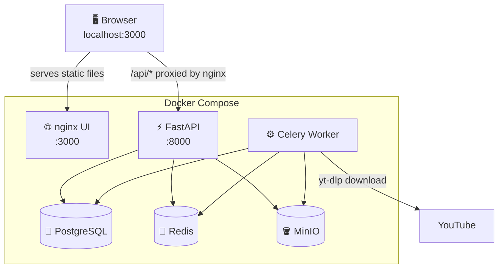
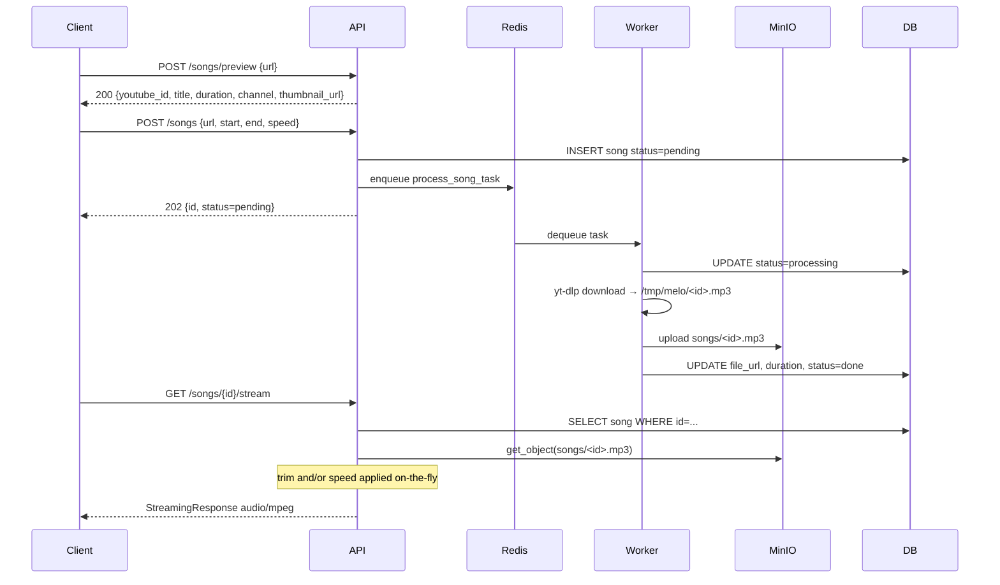
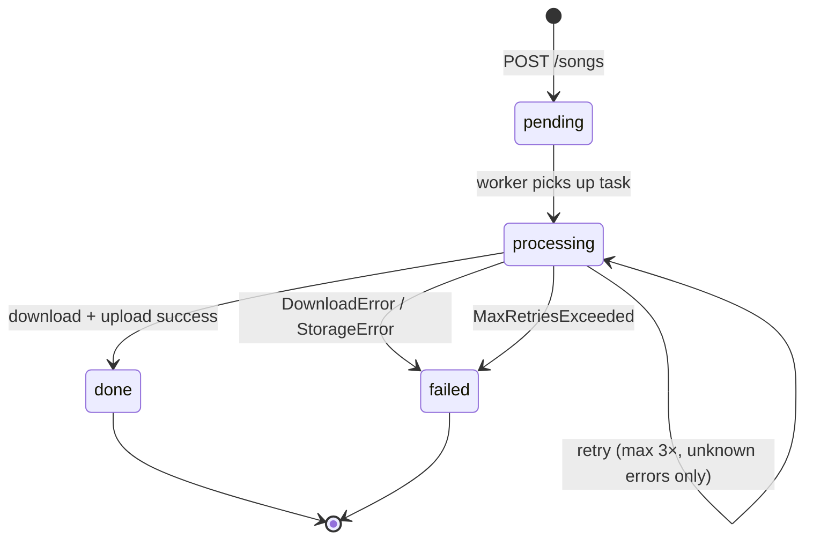
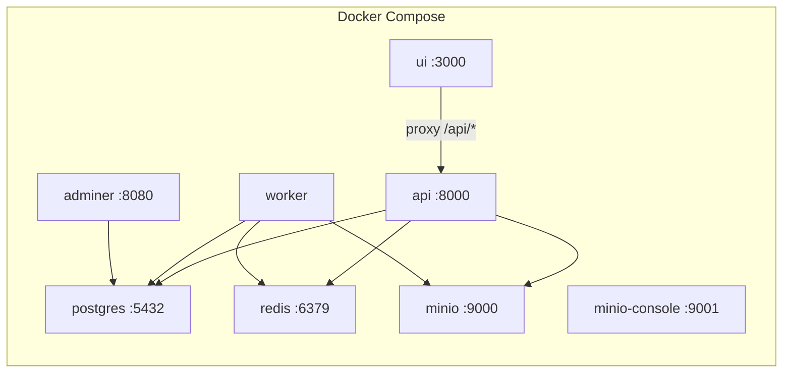

# 🎵 Melo

> Personal self-hosted audio library. Paste a YouTube URL → trimmed, speed-adjusted, playable mp3 stored in MinIO.

[](https://github.com/KarthikUdyawar/melo/actions/workflows/ci.yml)
[](https://codecov.io/gh/KarthikUdyawar/melo)
[](https://www.python.org/)
[](LICENSE)
[](https://pre-commit.com)
[](https://github.com/astral-sh/ruff)

---

## Stack

| Layer      | Tech                  |
| ---------- | --------------------- |
| UI         | Vanilla HTML/JS/CSS   |
| Serving    | nginx                 |
| API        | FastAPI + Uvicorn     |
| Queue      | Celery + Redis        |
| Download   | yt-dlp                |
| Processing | FFmpeg                |
| Storage    | MinIO (S3-compatible) |
| Database   | PostgreSQL 16         |
| Packaging  | uv                    |
| Runtime    | Docker Compose        |

---

## Architecture



---

## Async Job Flow



---

## Stream Case Matrix

| has_trim | has_speed | Behaviour                     |
| -------- | --------- | ----------------------------- |
| ❌        | ❌         | Direct MinIO proxy (fastest)  |
| ✅        | ❌         | Fetch → trim → stream         |
| ❌        | ✅         | Fetch → speed → stream        |
| ✅        | ✅         | Fetch → trim → speed → stream |

Speed uses FFmpeg `atempo` filter, chained for values outside `[0.5, 2.0]`:

```text
speed=4.0  → atempo=2.0,atempo=2.0
speed=0.25 → atempo=0.5,atempo=0.5
```

---

## Task State Machine



---

## Services



---

## Quickstart

```bash
# 1. Clone
git clone https://github.com/KarthikUdyawar/melo && cd melo

# 2. Configure
cp example.env .env.staging   # already set for Docker Compose

# 3. Start everything
make up
# → UI:       http://localhost:3000
# → API docs: http://localhost:8000/docs

# 4. Open the browser UI
open http://localhost:3000
# Paste a YouTube URL → Preview → Add to Melo → watch it process → play
```

### API-only usage

```bash
# Preview metadata before ingest
curl -X POST http://localhost:8000/songs/preview \
  -H "Content-Type: application/json" \
  -d '{"url": "https://www.youtube.com/watch?v=dQw4w9WgXcQ"}'

# Submit a song (with optional trim + speed)
curl -X POST http://localhost:8000/songs \
  -H "Content-Type: application/json" \
  -d '{"url": "https://www.youtube.com/watch?v=dQw4w9WgXcQ", "start": 10, "end": 60, "speed": 1.5}'

# Check status
curl http://localhost:8000/songs/<id>

# Stream when done
curl -OJ http://localhost:8000/songs/<id>/stream

# Favorite a song
curl -X POST http://localhost:8000/favorites/<id>

# Create a playlist and add a song
curl -X POST http://localhost:8000/playlists \
  -H "Content-Type: application/json" \
  -d '{"name": "Morning Mix"}'
curl -X POST http://localhost:8000/playlists/<playlist_id>/songs/<song_id>

# Run smoke test
make smoke
```

---

## UI

The browser UI is a vanilla HTML/JS/CSS SPA served by nginx at `http://localhost:3000`.

```
Sidebar nav → Library / Favorites / Playlists
[+ Add Song] → paste URL → preview → trim/speed → submit
Player bar → persistent, plays on song click, streams /api/songs/{id}/stream
Hash routing → #/ · #/favorites · #/playlists · #/playlists/:id
```

**Pages:**

| Route             | Description                                         |
| ----------------- | --------------------------------------------------- |
| `#/`              | Library — all songs, filter/search/sort, pagination |
| `#/favorites`     | Favorited songs                                     |
| `#/playlists`     | Playlist grid                                       |
| `#/playlists/:id` | Playlist detail with ordered song list              |

**Keyboard shortcuts:**

| Key     | Action       |
| ------- | ------------ |
| `Space` | Play / pause |
| `Esc`   | Close modal  |

**UI file layout:**

```text
ui/
  index.html     # app shell + Google Fonts
  style.css      # design tokens (CSS vars) + all component styles
  api.js         # fetch wrappers — envelope unwrap, all endpoints
  player.js      # <audio> element, scrubber sync, player state
  components.js  # renderSongCard, renderStatusPill, renderToast, …
  app.js         # hash router, page renderers, polling, event delegation
  nginx.conf     # SPA fallback + /api/ proxy → api:8000
  Dockerfile     # FROM nginx:alpine, COPY, done (~2s build)
```

No build step. No Node. No package manager. nginx serves files directly.

---

## Make Targets

Run `make` or `make help` to see all targets with descriptions.

| Target                    | Description                                   |
| ------------------------- | --------------------------------------------- |
| `make up`                 | Build + start all services detached           |
| `make down`               | Stop all services                             |
| `make down-v`             | Stop + delete all volumes                     |
| `make logs`               | Tail all logs                                 |
| `make logs-api`           | Tail API logs only                            |
| `make logs-worker`        | Tail worker logs only                         |
| `make logs-ui`            | Tail UI (nginx) logs only                     |
| `make ps`                 | Show service status                           |
| `make shell-api`          | Bash into api container                       |
| `make shell-worker`       | Bash into worker container                    |
| `make health`             | Hit /health endpoint                          |
| `make songs`              | List all songs                                |
| `make reset-db`           | Wipe all volumes and restart stack            |
| `make seed`               | Submit sample songs for development           |
| `make clean-tmp`          | Clear /tmp/melo inside worker container       |
| `make backup`             | Backup DB + MinIO to ./backups/               |
| `make backup-db`          | Backup PostgreSQL only                        |
| `make backup-minio`       | Backup MinIO bucket only                      |
| `make restore-db`         | Restore DB from FILE=backups/<name>.sql.gz    |
| `make restore-minio`      | Restore MinIO from FILE=backups/<name>.tar.gz |
| `make lint`               | Run ruff + mypy                               |
| `make fmt`                | Auto-format with ruff                         |
| `make smoke`              | End-to-end smoke test (curl + jq)             |
| `make smoke-ui`           | UI smoke test against running stack           |
| `make test`               | Run full test suite + coverage report         |
| `make test-unit`          | Unit tests only (no Docker needed)            |
| `make test-integration`   | Integration tests (requires Docker)           |
| `make test-cov`           | Tests + HTML coverage report                  |
| `make pre-commit`         | Run all pre-commit hooks on all files         |
| `make pre-commit-install` | Install pre-commit hooks (run once)           |

---

## API

| Method   | Path                              | Status | Description                                |
| -------- | --------------------------------- | ------ | ------------------------------------------ |
| `POST`   | `/songs/preview`                  | ✅      | Fetch YouTube metadata (no DB write)       |
| `POST`   | `/songs`                          | ✅      | Submit YouTube URL → async job             |
| `GET`    | `/songs`                          | ✅      | List songs — filter, sort, cursor-paginate |
| `GET`    | `/songs/{id}`                     | ✅      | Get song detail + status                   |
| `DELETE` | `/songs/{id}`                     | ✅      | Soft-delete a song + remove from MinIO     |
| `GET`    | `/songs/{id}/stream`              | ✅      | Stream mp3 (trim + speed applied)          |
| `POST`   | `/favorites/{song_id}`            | ✅      | Favorite a song (idempotent)               |
| `DELETE` | `/favorites/{song_id}`            | ✅      | Unfavorite a song                          |
| `GET`    | `/favorites`                      | ✅      | List favorited songs                       |
| `POST`   | `/playlists`                      | ✅      | Create a playlist                          |
| `GET`    | `/playlists`                      | ✅      | List all playlists                         |
| `GET`    | `/playlists/{id}`                 | ✅      | Get playlist detail with songs             |
| `DELETE` | `/playlists/{id}`                 | ✅      | Delete a playlist                          |
| `POST`   | `/playlists/{id}/songs/{song_id}` | ✅      | Add song to playlist (ordered)             |
| `DELETE` | `/playlists/{id}/songs/{song_id}` | ✅      | Remove song from playlist                  |
| `GET`    | `/health`                         | ✅      | Health check (DB + Redis + MinIO)          |

Interactive docs: **http://localhost:8000/docs**

### Filtering, Sorting & Pagination

`GET /songs` supports query parameters:

```text
status        pending | processing | done | failed
favorite      true | false
search        case-insensitive title match
sort_by       created_at (default) | title | duration
order         desc (default) | asc
limit         max records per page (default: 50)
after         cursor — UUID v7 id of last seen record
```

Response shape:

```json
{
  "records": [...],
  "count": 42,
  "bookmark": "<uuid-or-null>"
}
```

`bookmark` is the `id` of the last record returned. Pass it as `?after=<bookmark>` on the next request to get the next page. `null` means you've reached the end.

```bash
# First page — done songs, newest first
curl "http://localhost:8000/songs?status=done&limit=10"

# Next page
curl "http://localhost:8000/songs?status=done&limit=10&after=<bookmark>"

# Search by title
curl "http://localhost:8000/songs?search=lofi&sort_by=title&order=asc"

# Only favorites
curl "http://localhost:8000/songs?favorite=true"
```

---

## Ports

| Service       | URL                        |
| ------------- | -------------------------- |
| **UI**        | **http://localhost:3000**  |
| API           | http://localhost:8000      |
| API Docs      | http://localhost:8000/docs |
| MinIO Console | http://localhost:9001      |
| Adminer (DB)  | http://localhost:8080      |
| PostgreSQL    | localhost:5432             |
| Redis         | localhost:6379             |

---

## Folder Structure

```text
melo/
├── app/
│   ├── api/
│   │   ├── favorites.py    # POST/DELETE/GET /favorites
│   │   ├── playlists.py    # POST/DELETE/GET /playlists
│   │   ├── songs.py        # songs router incl. /preview + /stream
│   │   ├── _song_utils.py  # shared serialize_song + _is_favorited
│   │   └── responses.py    # envelope_response, paginated_response
│   ├── core/               # config, db, deps, logging, middleware
│   ├── models/
│   │   ├── song.py
│   │   ├── favorite.py
│   │   └── playlist.py
│   ├── schemas/            # Pydantic schemas
│   ├── services/           # downloader, processor, storage
│   └── workers/            # Celery app + tasks
├── ui/
│   ├── index.html          # app shell + Google Fonts
│   ├── style.css           # design tokens (CSS vars) + all styles
│   ├── api.js              # fetch wrappers (envelope unwrap)
│   ├── player.js           # <audio> element + player state
│   ├── components.js       # renderSongCard, renderStatusPill, renderToast, …
│   ├── app.js              # hash router + page logic + event delegation
│   ├── nginx.conf          # SPA fallback + /api/ proxy
│   └── Dockerfile          # FROM nginx:alpine, COPY, done
├── tests/
│   ├── conftest.py
│   ├── docker-compose.test.yml
│   ├── smoke_test.sh
│   ├── smoke_ui.sh
│   ├── unit/
│   └── integration/
├── docs/
│   ├── ARCHITECTURE.md
│   ├── DESIGN.md
│   ├── PRD.md
│   ├── USER-FLOW.md
│   └── sprints/
├── .github/
│   ├── workflows/ci.yml
│   ├── ISSUE_TEMPLATE/
│   └── PULL_REQUEST_TEMPLATE.md
├── docker-compose.yml
├── Dockerfile
├── Makefile
├── pyproject.toml
├── CONTRIBUTING.md
├── CHANGELOG.md
├── SECURITY.md
├── LICENSE
├── .pre-commit-config.yaml
├── .coderabbit.yaml
└── example.env
```

---

## Testing

```bash
# Unit tests only — no Docker needed, fast
make test-unit

# Full suite — spins up Postgres via pytest-docker
make test

# HTML coverage report → htmlcov/index.html
make test-cov
```

Coverage target: **80%** (currently **94.77%**).

Test layout:

| Module                                          | Type        |
| ----------------------------------------------- | ----------- |
| `tests/unit/test_schemas.py`                    | Unit        |
| `tests/unit/test_processor.py`                  | Unit        |
| `tests/unit/test_storage.py`                    | Unit        |
| `tests/unit/test_downloader.py`                 | Unit        |
| `tests/unit/test_preview.py`                    | Unit        |
| `tests/unit/test_favorites.py`                  | Unit        |
| `tests/unit/test_playlist_schemas.py`           | Unit        |
| `tests/integration/test_db.py`                  | Integration |
| `tests/integration/test_songs_api.py`           | Integration |
| `tests/integration/test_songs_api_filtering.py` | Integration |
| `tests/integration/test_preview_api.py`         | Integration |
| `tests/integration/test_favorites_api.py`       | Integration |
| `tests/integration/test_playlists_api.py`       | Integration |

---

## Contributing

See [CONTRIBUTING.md](CONTRIBUTING.md) for setup, branch naming, commit convention, and PR checklist.

---

## Decision Log

| Decision                                 | Reason                                                                                       |
| ---------------------------------------- | -------------------------------------------------------------------------------------------- |
| Vanilla HTML/JS/CSS for UI               | Zero build step; 2s Docker build; no Node/pnpm/WSL memory issues                             |
| nginx serves UI + proxies `/api/*`       | Single entry point; no CORS; `proxy_buffering off` for audio stream                          |
| Hash routing (`#/`)                      | No server config needed for SPA; nginx serves index.html for all paths                       |
| Single `<audio>` element                 | Persistent player across hash navigation; no framework state needed                          |
| ES modules (`type="module"`)             | Clean imports without bundler; native browser support                                        |
| No Alembic                               | Solo project; `create_all()` on startup sufficient                                           |
| `APP_ENV`-driven env files               | Clean separation: dev (localhost) / staging (Docker) / prod                                  |
| Pinned yt-dlp format selector            | `bestaudio` needs JS runtime; explicit IDs (`140/251/…`) use plain HTTPS                     |
| `worker_ready` signal for MinIO bucket   | Create once per process, not per task                                                        |
| Proxy stream via FastAPI                 | Presigned URLs signed to internal hostname break on host rewrite; API proxies bytes directly |
| `httpx` proxy for no-trim/speed stream   | Forwards browser `Range` header server-side → browser gets `206` → seeking works             |
| `FileResponse` for processed audio       | Starlette native range support; `BackgroundTask` handles tmp cleanup post-response           |
| `expire_on_commit=False`                 | Avoids lazy-load errors post-commit in Celery context                                        |
| Speed applied at stream time             | Avoid storing per-speed variants in MinIO                                                    |
| Chain `atempo` filters                   | FFmpeg atempo limited to 0.5–2.0 per stage                                                   |
| Trim before speed                        | Correct processing order — trim reduces data before re-encoding                              |
| Preview endpoint is stateless            | No DB writes; simpler system; worker re-probes as source of truth                            |
| Favorites idempotent (check-then-insert) | Solo user; race condition acceptable; avoids upsert complexity                               |
| Playlist ordering via `position`         | Predictable playback; auto-increments on add                                                 |
| UUID v7 for all PKs (`uuid6` package)    | String-sortable = chronological = natural cursor key for pagination                          |
| Cursor pagination (`after=<uuid>`)       | Stable under concurrent inserts; no offset drift                                             |
| DB-level filtering on `GET /songs`       | Scalability; avoids fetching and filtering in Python                                         |
| Soft delete on Song, Favorite, Playlist  | Safer than hard delete; preserves audit trail; `deleted_at` column; no Alembic needed        |
| `_song_utils.py` shared serializer       | Eliminates three copies of `_serialize_song`; avoids circular import                         |
| `tasks.py` excluded from coverage        | Celery internals require live worker; covered by `make smoke` instead                        |
| `make help` as default target            | 20+ targets — discoverability without reading Makefile                                       |
| Backup targets in Makefile               | `pg_dump` + MinIO `tar` via `docker compose exec`; timestamped to `./backups/`               |

---

## Out of Scope (v1)

- Multi-user auth, lyrics, waveforms → never (personal tool)
- Mobile layout → desktop-first, minimum 1280px
- Drag-to-reorder playlists, waveform display → post-v1
