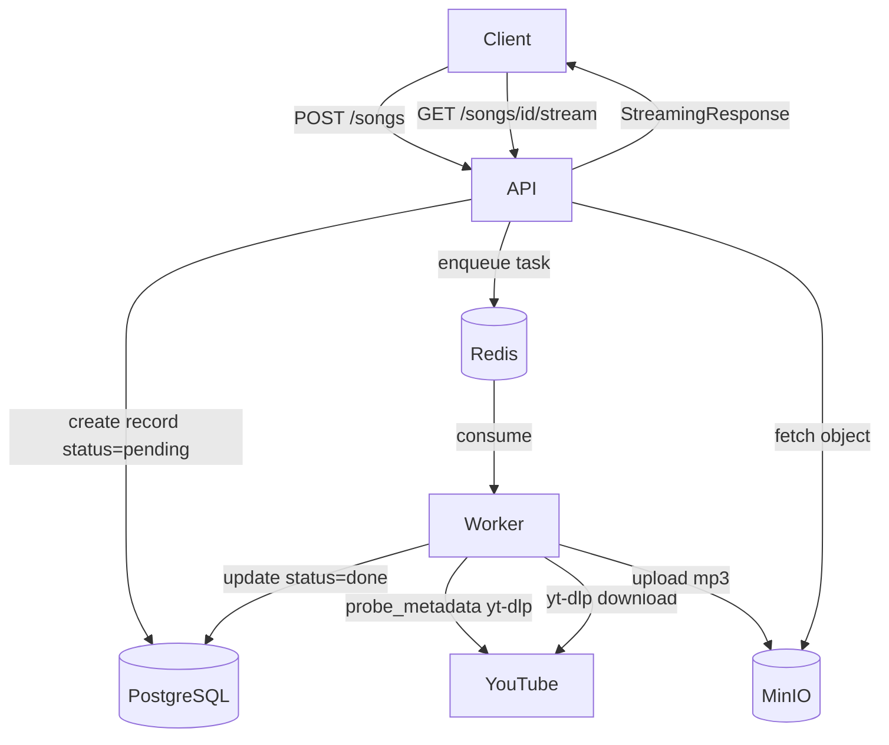
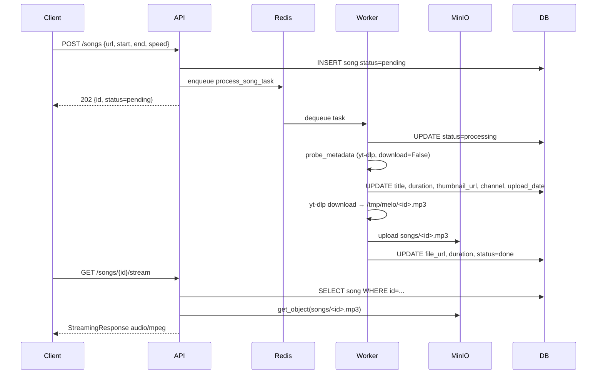
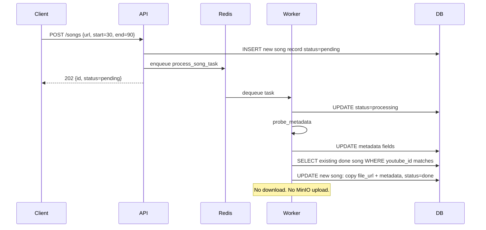
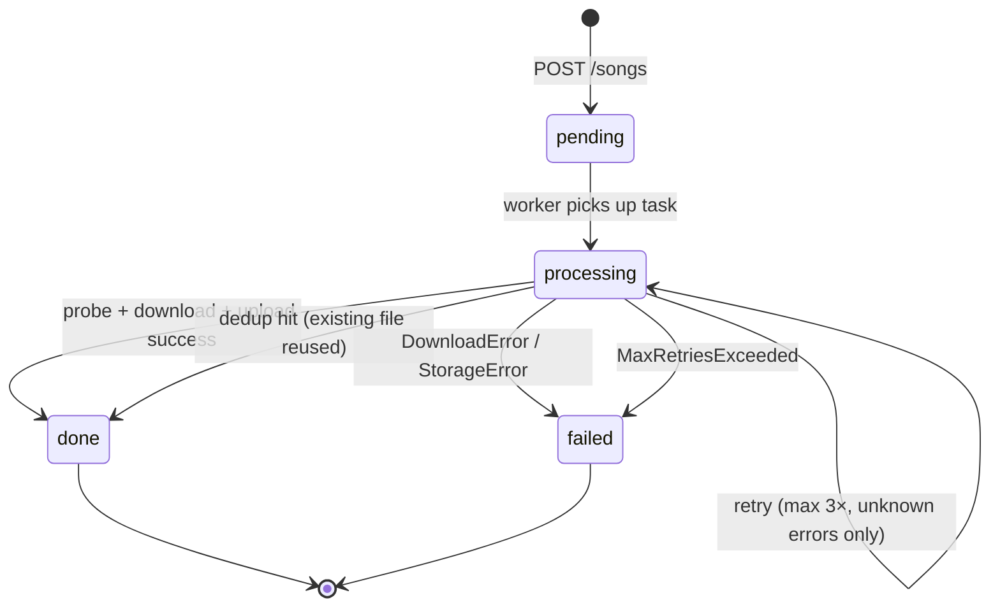
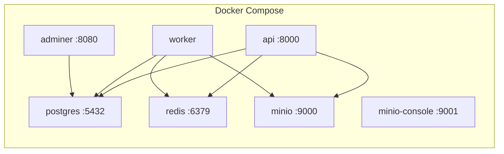

# 🎵 Melo

> Personal self-hosted audio library. Paste a YouTube URL → trimmed, playable mp3 stored in MinIO.

---

## Stack

| Layer      | Tech                  |
| ---------- | --------------------- |
| API        | FastAPI + Uvicorn     |
| Queue      | Celery + Redis        |
| Download   | yt-dlp                |
| Processing | FFmpeg                |
| Storage    | MinIO (S3-compatible) |
| Database   | PostgreSQL 16         |
| Packaging  | uv                    |
| Runtime    | Docker Compose        |

---

## Architecture



---

## Async Job Flow



---

## Dedup Flow (same youtube_id, different trim)



---

## Task State Machine



---

## Services



---

## Quickstart

```bash
# 1. Clone
git clone https://github.com/yourname/melo && cd melo

# 2. Configure
cp example.env .env.staging   # already set for Docker Compose

# 3. Run
make up

# 4. Submit a song
curl -X POST http://localhost:8000/songs \
  -H "Content-Type: application/json" \
  -d '{"url": "https://www.youtube.com/watch?v=dQw4w9WgXcQ", "speed": 1.0}'

# 5. Submit same song with trim (no re-download)
curl -X POST http://localhost:8000/songs \
  -H "Content-Type: application/json" \
  -d '{"url": "https://www.youtube.com/watch?v=dQw4w9WgXcQ", "start": 30, "end": 90}'

# 6. Check status
curl http://localhost:8000/songs/<id>

# 7. Download when done
curl -OJ http://localhost:8000/songs/<id>/stream
```

---

## Make Targets

| Target              | Description                         |
| ------------------- | ----------------------------------- |
| `make up`           | Build + start all services detached |
| `make down`         | Stop all services                   |
| `make down-v`       | Stop + delete all volumes           |
| `make logs`         | Tail all logs                       |
| `make logs-api`     | Tail API logs only                  |
| `make logs-worker`  | Tail worker logs only               |
| `make ps`           | Show service status                 |
| `make shell-api`    | Bash into api container             |
| `make shell-worker` | Bash into worker container          |
| `make health`       | Hit /health endpoint                |
| `make songs`        | List all songs                      |

---

## API

| Method | Path                 | Description                                                                                                                    |
| ------ | -------------------- | ------------------------------------------------------------------------------------------------------------------------------ |
| `POST` | `/songs`             | Submit YouTube URL → async job. Supports `start`, `end`, `speed` params. Same `youtube_id` + new trim → dedup, no re-download. |
| `GET`  | `/songs`             | List all songs with metadata                                                                                                   |
| `GET`  | `/songs/{id}`        | Get song detail + status + metadata                                                                                            |
| `GET`  | `/songs/{id}/stream` | Download mp3                                                                                                                   |
| `GET`  | `/health`            | Health check                                                                                                                   |

Interactive docs: **http://localhost:8000/docs**

### Song fields

| Field           | Type           | Notes                                              |
| --------------- | -------------- | -------------------------------------------------- |
| `id`            | UUID           |                                                    |
| `youtube_id`    | string         | Extracted from URL                                 |
| `title`         | string \| null | Populated by probe before download completes       |
| `duration`      | float \| null  | Seconds. Probe estimate, overwritten post-download |
| `thumbnail_url` | string \| null | YouTube thumbnail                                  |
| `channel`       | string \| null | Uploader channel name                              |
| `upload_date`   | string \| null | YYYYMMDD                                           |
| `start`         | float \| null  | Trim start in seconds                              |
| `end`           | float \| null  | Trim end in seconds                                |
| `speed`         | float          | Playback speed (0.5–4.0)                           |
| `status`        | enum           | `pending` → `processing` → `done` / `failed`       |
| `file_url`      | string \| null | MinIO object key, set when `done`                  |

---

## Folder Structure

```
melo/
├── app/
│   ├── api/          # FastAPI routers
│   ├── core/         # config, db, deps
│   ├── models/       # SQLAlchemy models
│   ├── schemas/      # Pydantic schemas
│   ├── services/     # downloader, storage
│   └── workers/      # Celery app + tasks
├── docs/
│   └── sprints/
├── docker-compose.yml
├── Dockerfile
├── Makefile
├── pyproject.toml
└── example.env
```

---

## Ports

| Service       | URL                        |
| ------------- | -------------------------- |
| API           | http://localhost:8000      |
| API Docs      | http://localhost:8000/docs |
| MinIO Console | http://localhost:9001      |
| Adminer (DB)  | http://localhost:8080      |
| PostgreSQL    | localhost:5432             |
| Redis         | localhost:6379             |

---

## Decision Log

| Decision                               | Reason                                                                                                                             |
| -------------------------------------- | ---------------------------------------------------------------------------------------------------------------------------------- |
| No Alembic                             | Solo project; `create_all()` on startup sufficient                                                                                 |
| `APP_ENV`-driven env files             | Clean separation: dev (localhost) / staging (Docker) / prod                                                                        |
| Pinned yt-dlp format selector          | `bestaudio` needs JS runtime; explicit IDs (`140/251/…`) use plain HTTPS                                                           |
| Same format selector on probe          | `download=False` still triggers JS-runtime format checks; pinned IDs + `skip:[hls,dash]` suppress 5min hang and warning            |
| `noplaylist: True` on probe + download | Playlist URLs must resolve to single `?v=` video; without this yt-dlp picks wrong video from playlist context                      |
| `worker_ready` signal for MinIO bucket | Create once per process, not per task                                                                                              |
| Proxy stream via FastAPI               | Presigned URLs signed to internal hostname break on host rewrite; API proxies bytes directly                                       |
| `expire_on_commit=False`               | Avoids lazy-load errors post-commit in Celery context                                                                              |
| Removed `unique=True` on `youtube_id`  | Dedup-with-trim requires multiple DB rows per video; uniqueness enforced at task level                                             |
| Dedup at task level, not router level  | Router inserts new record for every submission; worker detects existing `done` record and fast-paths to `done` without re-download |
| `probe_metadata` before download       | Populates title, thumbnail, channel immediately — `GET /songs/{id}` returns useful data while still `processing`                   |
| All new `SongResponse` fields nullable | Record serialized at creation (pre-probe); fields populated async — cannot be required                                             |

---

## Out of Scope (v1)

- FFmpeg trim on stream → Sprint 2 (FFMPEG-1, in progress)
- Speed processing (`atempo`) → Sprint 2
- Favorites + playlists endpoints → Sprint 3
- Frontend UI → Sprint 3
- Multi-user auth, lyrics, waveforms → never (personal tool)
