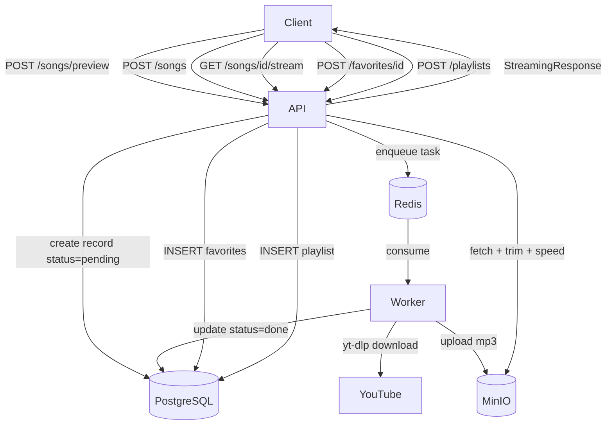
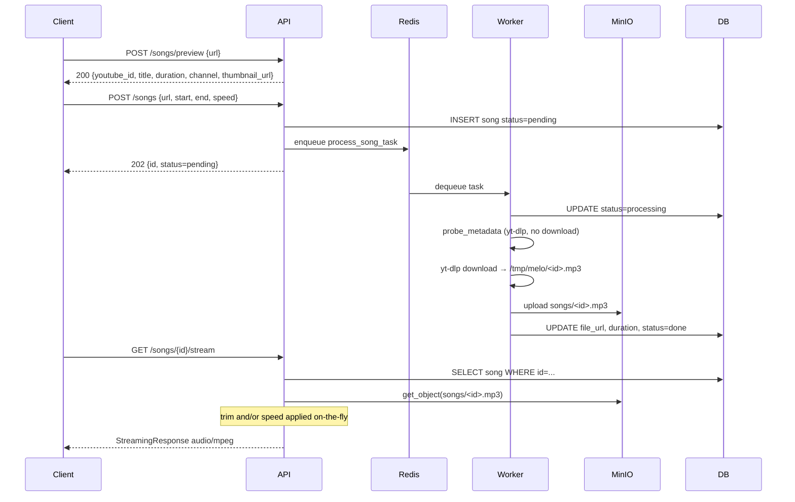
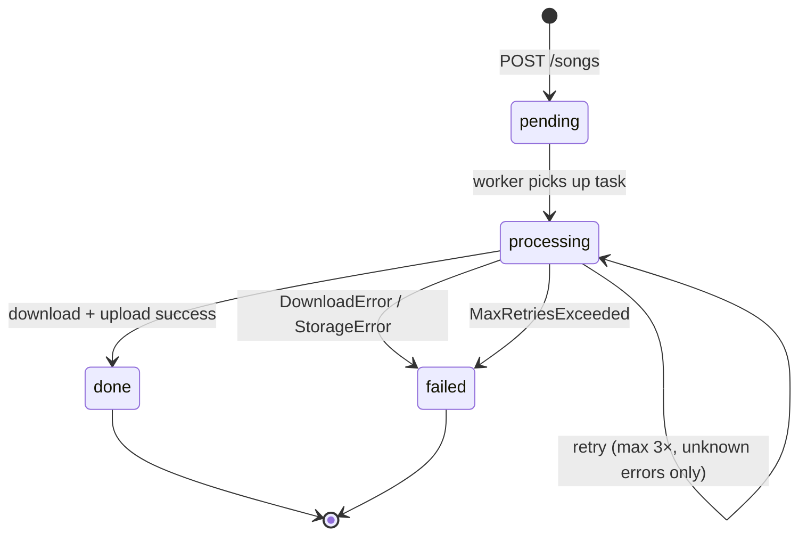
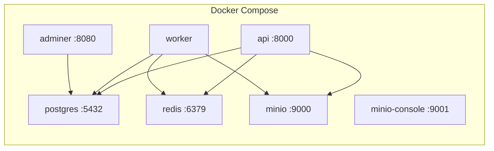

# 🎵 Melo

> Personal self-hosted audio library. Paste a YouTube URL → trimmed, speed-adjusted, playable mp3 stored in MinIO.

---

## Stack

| Layer      | Tech                  |
| ---------- | --------------------- |
| API        | FastAPI + Uvicorn     |
| Queue      | Celery + Redis        |
| Download   | yt-dlp                |
| Processing | FFmpeg                |
| Storage    | MinIO (S3-compatible) |
| Database   | PostgreSQL 16         |
| Packaging  | uv                    |
| Runtime    | Docker Compose        |

---

## Architecture



---

## Async Job Flow



---

## Stream Case Matrix

| has_trim | has_speed | Behaviour                     |
| -------- | --------- | ----------------------------- |
| ❌        | ❌         | Direct MinIO proxy (fastest)  |
| ✅        | ❌         | Fetch → trim → stream         |
| ❌        | ✅         | Fetch → speed → stream        |
| ✅        | ✅         | Fetch → trim → speed → stream |

Speed uses FFmpeg `atempo` filter, chained for values outside `[0.5, 2.0]`:

```text
speed=4.0  → atempo=2.0,atempo=2.0
speed=0.25 → atempo=0.5,atempo=0.5
```

---

## Task State Machine



---

## Services



---

## Quickstart

```bash
# 1. Clone
git clone https://github.com/KarthikUdyawar/melo && cd melo

# 2. Configure
cp example.env .env.staging   # already set for Docker Compose

# 3. Run
make up

# 4. Preview metadata before ingest
curl -X POST http://localhost:8000/songs/preview \
  -H "Content-Type: application/json" \
  -d '{"url": "https://www.youtube.com/watch?v=dQw4w9WgXcQ"}'

# 5. Submit a song (with optional trim + speed)
curl -X POST http://localhost:8000/songs \
  -H "Content-Type: application/json" \
  -d '{"url": "https://www.youtube.com/watch?v=dQw4w9WgXcQ", "start": 10, "end": 60, "speed": 1.5}'

# 6. Check status
curl http://localhost:8000/songs/<id>

# 7. Stream when done
curl -OJ http://localhost:8000/songs/<id>/stream

# 8. Favorite a song
curl -X POST http://localhost:8000/favorites/<id>

# 9. List favorites
curl http://localhost:8000/favorites

# 10. Create a playlist
curl -X POST http://localhost:8000/playlists \
  -H "Content-Type: application/json" \
  -d '{"name": "Morning Mix"}'

# 11. Add a song to a playlist
curl -X POST http://localhost:8000/playlists/<playlist_id>/songs/<song_id>

# 12. List playlists
curl http://localhost:8000/playlists

# 13. Run smoke test
make smoke
```

---

## Make Targets

| Target                    | Description                           |
| ------------------------- | ------------------------------------- |
| `make up`                 | Build + start all services detached   |
| `make down`               | Stop all services                     |
| `make down-v`             | Stop + delete all volumes             |
| `make logs`               | Tail all logs                         |
| `make logs-api`           | Tail API logs only                    |
| `make logs-worker`        | Tail worker logs only                 |
| `make ps`                 | Show service status                   |
| `make shell-api`          | Bash into api container               |
| `make shell-worker`       | Bash into worker container            |
| `make health`             | Hit /health endpoint                  |
| `make songs`              | List all songs                        |
| `make smoke`              | End-to-end smoke test (curl + jq)     |
| `make test`               | Run full test suite + coverage report |
| `make test-unit`          | Unit tests only (no Docker needed)    |
| `make test-integration`   | Integration tests (requires Docker)   |
| `make test-cov`           | Tests + HTML coverage report          |
| `make pre-commit`         | Run all pre-commit hooks on all files |
| `make pre-commit-install` | Install pre-commit hooks (run once)   |

---

## API

| Method   | Path                              | Status | Description                          |
| -------- | --------------------------------- | ------ | ------------------------------------ |
| `POST`   | `/songs/preview`                  | ✅      | Fetch YouTube metadata (no DB write) |
| `POST`   | `/songs`                          | ✅      | Submit YouTube URL → async job       |
| `GET`    | `/songs`                          | ✅      | List all songs (with `is_favorite`)  |
| `GET`    | `/songs/{id}`                     | ✅      | Get song detail + status             |
| `GET`    | `/songs/{id}/stream`              | ✅      | Stream mp3 (trim + speed applied)    |
| `POST`   | `/favorites/{song_id}`            | ✅      | Favorite a song (idempotent)         |
| `DELETE` | `/favorites/{song_id}`            | ✅      | Unfavorite a song                    |
| `GET`    | `/favorites`                      | ✅      | List favorited songs                 |
| `POST`   | `/playlists`                      | ✅      | Create a playlist                    |
| `GET`    | `/playlists`                      | ✅      | List all playlists                   |
| `GET`    | `/playlists/{id}`                 | ✅      | Get playlist detail with songs       |
| `POST`   | `/playlists/{id}/songs/{song_id}` | ✅      | Add song to playlist (ordered)       |
| `DELETE` | `/playlists/{id}/songs/{song_id}` | ✅      | Remove song from playlist            |
| `GET`    | `/health`                         | ✅      | Health check                         |

Interactive docs: **http://localhost:8000/docs**

### Preview Flow

```text
POST /songs/preview → inspect title, duration, thumbnail
        ↓
User decides trim/speed params
        ↓
POST /songs → async download + processing
        ↓
GET /songs/{id}/stream → playback
```

### Favorites

```bash
# Favorite
curl -X POST http://localhost:8000/favorites/<song_id>
# → 201 first time, 200 if already favorited (idempotent)

# Unfavorite
curl -X DELETE http://localhost:8000/favorites/<song_id>
# → 204

# List
curl http://localhost:8000/favorites
# → {records: [...songs with is_favorite=true], count: N}
```

`is_favorite` is also reflected in `GET /songs` and `GET /songs/{id}`.

### Playlists

```bash
# Create
curl -X POST http://localhost:8000/playlists \
  -H "Content-Type: application/json" \
  -d '{"name": "Morning Mix"}'
# → 201 {id, name, created_at, songs: []}

# Add song (appended at end; position maintained automatically)
curl -X POST http://localhost:8000/playlists/<playlist_id>/songs/<song_id>
# → 201

# View playlist with ordered songs
curl http://localhost:8000/playlists/<playlist_id>
# → {id, name, songs: [...ordered by position]}

# Remove song
curl -X DELETE http://localhost:8000/playlists/<playlist_id>/songs/<song_id>
# → 204

# List all playlists
curl http://localhost:8000/playlists
# → {records: [...], count: N}
```

Songs can appear in multiple playlists. Position is maintained per-playlist and auto-increments on add.

---

## Folder Structure

```text
melo/
├── app/
│   ├── api/
│   │   ├── favorites.py   # POST/DELETE/GET /favorites
│   │   ├── playlists.py   # POST/DELETE/GET /playlists
│   │   ├── songs.py       # songs router incl. /preview
│   │   └── responses.py   # envelope_response, paginated_response
│   ├── core/              # config, db, deps, logging, middleware
│   ├── models/
│   │   ├── song.py
│   │   ├── favorite.py
│   │   └── playlist.py
│   ├── schemas/           # Pydantic schemas
│   ├── services/          # downloader, processor, storage
│   └── workers/           # Celery app + tasks
├── tests/
│   ├── conftest.py
│   ├── docker-compose.test.yml
│   ├── smoke_test.sh
│   ├── unit/
│   └── integration/
├── docs/
│   ├── PRD.md
│   └── sprints/
├── docker-compose.yml
├── Dockerfile
├── Makefile
├── pyproject.toml
├── .pre-commit-config.yaml
├── .coderabbit.yaml
└── example.env
```

---

## Ports

| Service       | URL                        |
| ------------- | -------------------------- |
| API           | http://localhost:8000      |
| API Docs      | http://localhost:8000/docs |
| MinIO Console | http://localhost:9001      |
| Adminer (DB)  | http://localhost:8080      |
| PostgreSQL    | localhost:5432             |
| Redis         | localhost:6379             |

---

## Testing

```bash
# Unit tests only — no Docker needed, fast
make test-unit

# Full suite — spins up Postgres via pytest-docker
make test

# HTML coverage report → htmlcov/index.html
make test-cov
```

Coverage target: **80%** (currently **94.77%**).

Test layout:

| Module                                    | Type        |
| ----------------------------------------- | ----------- |
| `tests/unit/test_schemas.py`              | Unit        |
| `tests/unit/test_processor.py`            | Unit        |
| `tests/unit/test_storage.py`              | Unit        |
| `tests/unit/test_downloader.py`           | Unit        |
| `tests/unit/test_preview.py`              | Unit        |
| `tests/unit/test_favorites.py`            | Unit        |
| `tests/unit/test_playlist_schemas.py`     | Unit        |
| `tests/integration/test_db.py`            | Integration |
| `tests/integration/test_songs_api.py`     | Integration |
| `tests/integration/test_preview_api.py`   | Integration |
| `tests/integration/test_favorites_api.py` | Integration |
| `tests/integration/test_playlists_api.py` | Integration |

---

## Decision Log

| Decision                                   | Reason                                                                                       |
| ------------------------------------------ | -------------------------------------------------------------------------------------------- |
| No Alembic                                 | Solo project; `create_all()` on startup sufficient                                           |
| `APP_ENV`-driven env files                 | Clean separation: dev (localhost) / staging (Docker) / prod                                  |
| Pinned yt-dlp format selector              | `bestaudio` needs JS runtime; explicit IDs (`140/251/…`) use plain HTTPS                     |
| `worker_ready` signal for MinIO bucket     | Create once per process, not per task                                                        |
| Proxy stream via FastAPI                   | Presigned URLs signed to internal hostname break on host rewrite; API proxies bytes directly |
| `expire_on_commit=False`                   | Avoids lazy-load errors post-commit in Celery context                                        |
| Speed applied at stream time               | Avoid storing per-speed variants in MinIO                                                    |
| Chain `atempo` filters                     | FFmpeg atempo limited to 0.5–2.0 per stage                                                   |
| Trim before speed                          | Correct processing order — trim reduces data before re-encoding                              |
| `created_paths` list in stream endpoint    | Guarantees cleanup of all temp files regardless of which pipeline steps ran                  |
| Preview endpoint is stateless              | No DB writes; simpler system; worker re-probes as source of truth                            |
| Favorites idempotent (check-then-insert)   | Solo user; race condition acceptable; avoids upsert complexity                               |
| `is_favorite` queried per song             | N+1 acceptable at MVP scale; batch subquery deferred to API-2                                |
| `DELETE /favorites` returns 204            | No body on delete; 404 if not favorited for explicit error feedback                          |
| Playlist ordering via `position`           | Predictable playback; auto-increments on add                                                 |
| `db.expire_all()` after playlist mutations | Clears stale relationship state from SQLAlchemy identity map post-commit                     |
| Same song reusable across playlists        | `playlist_songs` join table scoped per playlist; no uniqueness constraint on `song_id`       |
| SQLite truncation for unit test isolation  | Savepoint rollback unreliable when endpoint calls `db.commit()` release the savepoint        |
| Root `conftest.py` for env setup           | `pytest_configure` runs before collection — only reliable hook for early env vars            |
| `tasks.py` excluded from coverage          | Celery internals require live worker; covered by `make smoke` instead                        |
| `# nosec B108/B603/B607` in processor      | `/tmp/melo` intentional; subprocess args are internal constants only, never user input       |

---

## Out of Scope (v1)

- Filtering, sorting, search → Sprint 3 API-2 (in progress)
- Frontend UI → Sprint 4
- Multi-user auth, lyrics, waveforms → never (personal tool)
