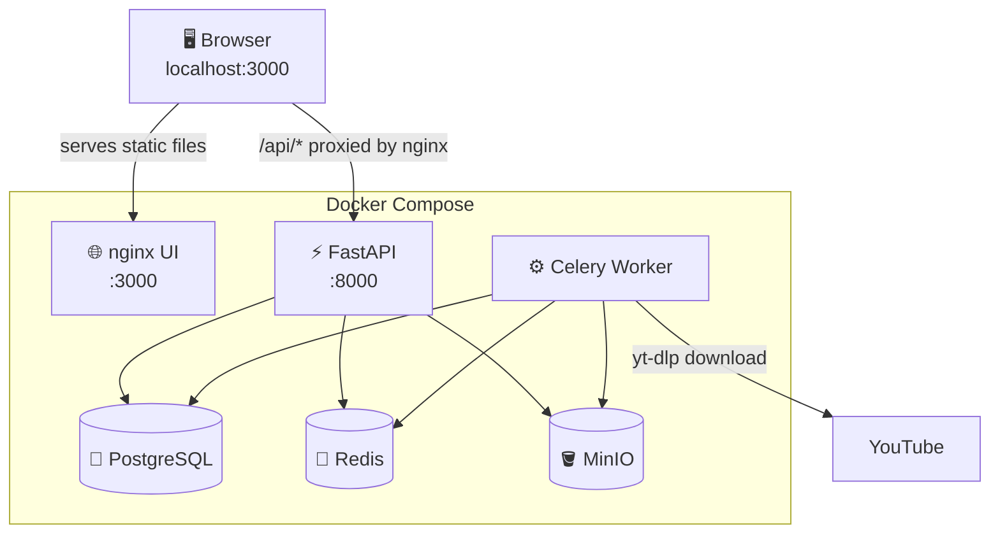
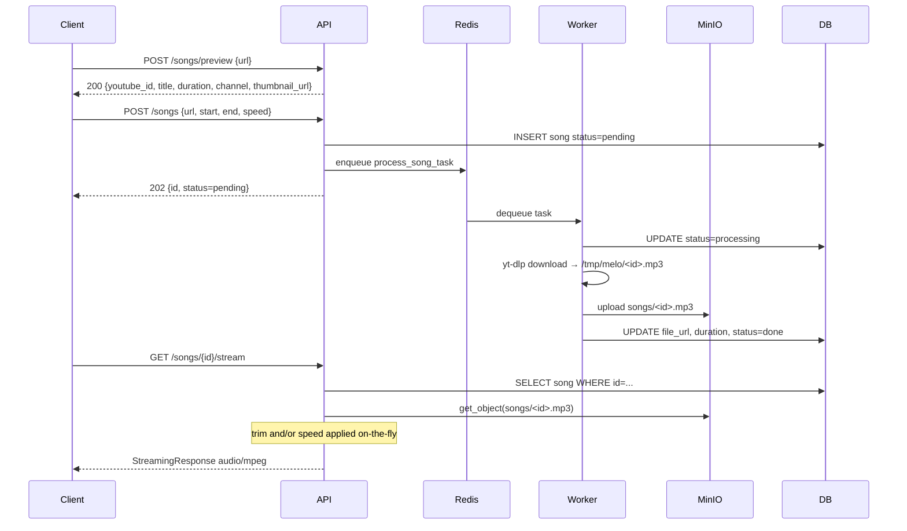
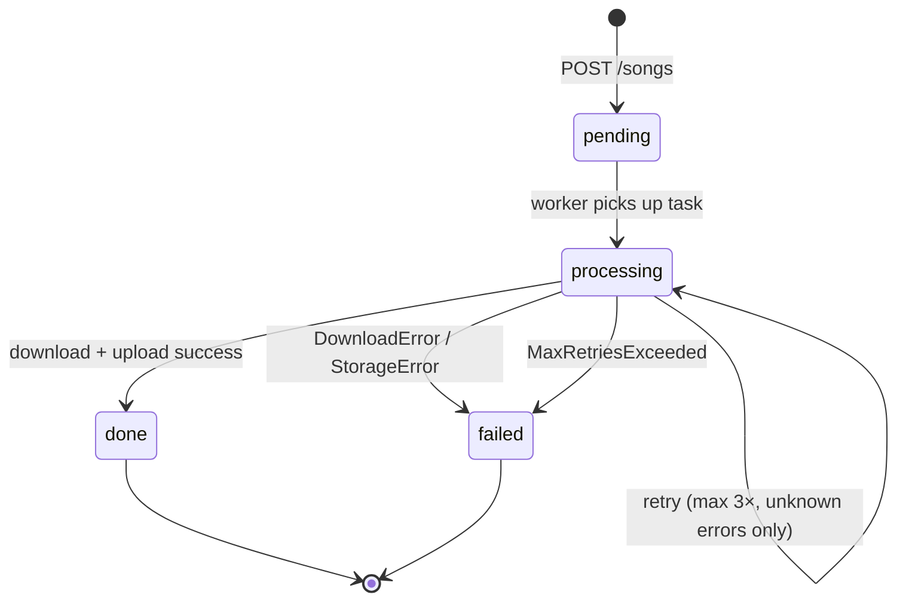
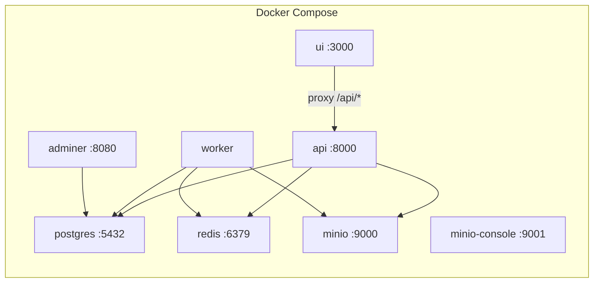

# 🎵 Melo

> Personal self-hosted audio library. Paste a YouTube URL → trimmed, speed-adjusted, playable mp3 stored in MinIO. Full observability stack included.

[](https://github.com/KarthikUdyawar/melo/actions/workflows/ci.yml)
[](https://codecov.io/gh/KarthikUdyawar/melo)
[](https://www.python.org/)
[](LICENSE)
[](https://pre-commit.com)
[](https://github.com/astral-sh/ruff)

---

## Stack

| Layer         | Tech                                                    |
| ------------- | ------------------------------------------------------- |
| UI            | Vanilla HTML/JS/CSS                                     |
| Serving       | nginx                                                   |
| API           | FastAPI + Uvicorn                                       |
| Queue         | Celery + Redis                                          |
| Download      | yt-dlp                                                  |
| Processing    | FFmpeg                                                  |
| Storage       | MinIO (S3-compatible)                                   |
| Database      | PostgreSQL 16                                           |
| Packaging     | uv                                                      |
| Runtime       | Docker Compose                                          |
| Observability | Prometheus, Loki, Tempo, Grafana, Pyroscope (see below) |
| Admin         | Streamlit dashboard (`admin/`)                          |

---

## Architecture


```mermaid
graph TD
    Browser["🖥️ Browser\nlocalhost:3000"] -->|serves static files| UI["🌐 nginx UI\n:3000"]
    Browser -->|"/api/* proxied by nginx"| API

    subgraph Docker Compose
        UI
        API["⚡ FastAPI\n:8000"]
        Worker["⚙️ Celery Worker"]
        PG[("🐘 PostgreSQL")]
        Redis[("🔴 Redis")]
        MinIO[("🪣 MinIO")]
    end

    API --> PG
    API --> Redis
    API --> MinIO
    Worker --> PG
    Worker --> Redis
    Worker -->|yt-dlp download| YT[YouTube]
    Worker --> MinIO
```

> The observability stack (Prometheus/Loki/Tempo/Grafana/Pyroscope/exporters/admin) runs as a **separate** Compose file (`infra/docker-compose.monitoring.yml`) layered on top of this one — see [Observability](#observability) below.

---

## Async Job Flow


```mermaid
sequenceDiagram
    participant C as Client
    participant A as API
    participant R as Redis
    participant W as Worker
    participant M as MinIO
    participant D as DB

    C->>A: POST /songs/preview {url}
    A-->>C: 200 {youtube_id, title, duration, channel, thumbnail_url}

    C->>A: POST /songs {url, start, end, speed}
    A->>D: INSERT song status=pending
    A->>R: enqueue process_song_task
    A-->>C: 202 {id, status=pending}

    R->>W: dequeue task
    W->>D: UPDATE status=processing
    W->>W: yt-dlp download → /tmp/melo/<id>.mp3
    W->>M: upload songs/<id>.mp3
    W->>D: UPDATE file_url, duration, status=done

    C->>A: GET /songs/{id}/stream
    A->>D: SELECT song WHERE id=...
    A->>M: get_object(songs/<id>.mp3)
    note over A: trim and/or speed applied on-the-fly
    A-->>C: StreamingResponse audio/mpeg
```

---

## Stream Case Matrix

| has_trim | has_speed | Behaviour                     |
| -------- | --------- | ----------------------------- |
| ❌        | ❌         | Direct MinIO proxy (fastest)  |
| ✅        | ❌         | Fetch → trim → stream         |
| ❌        | ✅         | Fetch → speed → stream        |
| ✅        | ✅         | Fetch → trim → speed → stream |

Speed uses FFmpeg `atempo` filter, chained for values outside `[0.5, 2.0]`:

```text
speed=4.0  → atempo=2.0,atempo=2.0
speed=0.25 → atempo=0.5,atempo=0.5
```

---

## Task State Machine


```mermaid
stateDiagram-v2
    [*] --> pending: POST /songs
    pending --> processing: worker picks up task
    processing --> done: download + upload success
    processing --> failed: DownloadError / StorageError
    processing --> processing: retry (max 3×, unknown errors only)
    processing --> failed: MaxRetriesExceeded
    done --> [*]
    failed --> [*]
```

---

## Services


```mermaid
graph LR
    subgraph Docker Compose
        UI[ui :3000]
        API[api :8000]
        Worker[worker]
        PG[postgres :5432]
        Redis[redis :6379]
        MinIO[minio :9000]
        Adminer[adminer :8080]
        MinIOConsole[minio-console :9001]
    end

    UI -->|proxy /api/*| API
    API --> PG
    API --> Redis
    API --> MinIO
    Worker --> PG
    Worker --> Redis
    Worker --> MinIO
    Adminer --> PG
```

---

## Quickstart

```bash
# 1. Clone
git clone https://github.com/KarthikUdyawar/melo && cd melo

# 2. Configure
cp example.env .env.staging   # already set for Docker Compose

# 3. Start everything
make up
# → UI:       http://localhost:3000
# → API docs: http://localhost:8000/docs

# 4. Open the browser UI
open http://localhost:3000
# Paste a YouTube URL → Preview → Add to Melo → watch it process → play

# 5. (optional) Start the observability stack
make monitoring-up-all
# → Grafana:  http://localhost:3001
```

### API-only usage

```bash
# Preview metadata before ingest
curl -X POST http://localhost:8000/songs/preview \
  -H "Content-Type: application/json" \
  -d '{"url": "https://www.youtube.com/watch?v=dQw4w9WgXcQ"}'

# Submit a song (with optional trim + speed)
curl -X POST http://localhost:8000/songs \
  -H "Content-Type: application/json" \
  -d '{"url": "https://www.youtube.com/watch?v=dQw4w9WgXcQ", "start": 10, "end": 60, "speed": 1.5}'

# Check status
curl http://localhost:8000/songs/<id>

# Stream when done
curl -OJ http://localhost:8000/songs/<id>/stream

# Favorite a song
curl -X POST http://localhost:8000/favorites/<id>

# Create a playlist and add a song
curl -X POST http://localhost:8000/playlists \
  -H "Content-Type: application/json" \
  -d '{"name": "Morning Mix"}'
curl -X POST http://localhost:8000/playlists/<playlist_id>/songs/<song_id>

# Run smoke test
make smoke
```

---

## UI

The browser UI is a vanilla HTML/JS/CSS SPA served by nginx at `http://localhost:3000`.

```
Sidebar nav → Library / Favorites / Playlists
[+ Add Song] → paste URL → preview → trim/speed → submit
Player bar → persistent, plays on song click, streams /api/songs/{id}/stream
Hash routing → #/ · #/favorites · #/playlists · #/playlists/:id
```

**Pages:**

| Route             | Description                                         |
| ----------------- | --------------------------------------------------- |
| `#/`              | Library — all songs, filter/search/sort, pagination |
| `#/favorites`     | Favorited songs                                     |
| `#/playlists`     | Playlist grid                                       |
| `#/playlists/:id` | Playlist detail with ordered song list              |

**Keyboard shortcuts:**

| Key     | Action                                            |
| ------- | ------------------------------------------------- |
| `Space` | Play / pause (ignored while focus is in an input) |
| `Esc`   | Close modal                                       |

**UI file layout:**

```text
ui/
  index.html     # app shell + Google Fonts
  style.css      # design tokens (CSS vars) + all component styles
  api.js         # fetch wrappers — envelope unwrap, all endpoints
  player.js      # <audio> element, scrubber sync, player state
  components.js  # renderSongCard, renderStatusPill, renderToast, …
  app.js         # hash router, page renderers, polling, event delegation
  nginx.conf     # SPA fallback + /api/ proxy → api:8000
  Dockerfile     # FROM nginx:alpine, COPY, done (~2s build)
```

No build step. No Node. No package manager. nginx serves files directly. (React/Vite was tried first and scrapped — WSL2 Docker Desktop memory pressure during builds.)

---

## Observability

Full three-pillar observability stack (logs, metrics, traces) plus continuous profiling, alerting, and a Streamlit admin dashboard — all provisioned as code, all starting with a single command. Runs as a separate Compose file layered on the main stack.

```bash
make monitoring-up       # app must already be running
make monitoring-up-all   # start app + observability together
```

**What's included:**

| Pillar / Tool   | Detail                                                                                                                                             |
| --------------- | -------------------------------------------------------------------------------------------------------------------------------------------------- |
| Logs            | structlog dual renderer (stdout human-readable + JSONL file), rotation (size/age), gzip + MinIO backup, 90-day retention cleanup via APScheduler   |
| Metrics         | Prometheus — HTTP auto-instrumentation + custom counters/gauges/histograms at `GET /metrics`; Postgres/Redis/MinIO/Celery/container/host exporters |
| Traces          | OpenTelemetry auto + manual spans → Tempo; `X-Trace-Id` on every API response; `trace_id` in every log line; Celery task context propagation       |
| Profiling       | Pyroscope continuous profiling (FastAPI + Celery worker), no sampling                                                                              |
| Dashboards      | 3 Grafana dashboards (API, Pipeline, System), provisioned as JSON — no manual import                                                               |
| Alerting        | Grafana's built-in Alertmanager → Telegram, 8 provisioned alert rules                                                                              |
| Admin dashboard | Streamlit at `:8501` — overview, songs, logs, metrics, alerts, DB health, single `ADMIN_PASSWORD` gate                                             |

**New ports:**

| Service           | URL                             |
| ----------------- | ------------------------------- |
| Grafana           | http://localhost:3001           |
| Prometheus        | http://localhost:9090           |
| Loki              | http://localhost:3100           |
| Tempo (OTLP gRPC) | http://localhost:4317           |
| Tempo (HTTP)      | http://localhost:4318           |
| Tempo (UI/API)    | http://localhost:3200           |
| Pyroscope         | http://localhost:4040           |
| Flower            | http://localhost:5555 (no auth) |
| cAdvisor          | http://localhost:8090           |
| Node Exporter     | http://localhost:9100           |
| Postgres Exporter | http://localhost:9187           |
| Redis Exporter    | http://localhost:9121           |
| Streamlit admin   | http://localhost:8501           |

**New Makefile targets:**

| Target                    | Description                                          |
| ------------------------- | ---------------------------------------------------- |
| `make monitoring-up`      | Start observability stack (main app must be running) |
| `make monitoring-up-all`  | Start app + observability stack together             |
| `make monitoring-down`    | Stop observability stack                             |
| `make monitoring-restart` | Restart observability stack                          |
| `make monitoring-status`  | Show observability stack container status            |
| `make grafana`            | Open Grafana in browser                              |
| `make flower`             | Open Flower in browser                               |
| `make admin`              | Open Streamlit admin in browser                      |
| `make metrics`            | Curl `/metrics` endpoint                             |
| `make logs-loki`          | Tail recent logs via Loki HTTP API                   |
| `make cadvisor-ids`       | Print cAdvisor container IDs (see note below)        |

New env vars (all in `example.env`): `GRAFANA_ADMIN_PASSWORD`, `TELEGRAM_BOT_TOKEN`, `TELEGRAM_CHAT_ID`, `ADMIN_PASSWORD`, `LOG_MAX_SIZE_MB`, `LOG_MAX_AGE_HOURS`, `LOG_BACKUP_BUCKET`, `LOG_RETENTION_DAYS`, `PYROSCOPE_SERVER_URL`. Worker also runs with `CELERY_SEND_EVENTS=True` / `CELERY_TASK_TRACK_STARTED=True` for `celery-exporter`.

> **WSL2 Docker Desktop note:** `cAdvisor` can't resolve container names/labels on WSL2 (daemon storage lives in Docker Desktop's internal VM). The system dashboard matches by cgroup ID instead — re-run `make cadvisor-ids` after recreating containers. See `docs/DECISIONS.md` for this and other WSL2-specific workarounds.

Full breakdown: `docs/PRD.md` and `docs/sprints/Sprint-5.md`.

---

## Make Targets

Run `make` or `make help` to see all targets with descriptions.

| Target                    | Description                                   |
| ------------------------- | --------------------------------------------- |
| `make up`                 | Build + start all services detached           |
| `make down`               | Stop all services                             |
| `make down-v`             | Stop + delete all volumes                     |
| `make restart`            | Restart the stack                             |
| `make rebuild`            | Rebuild all Docker images without cache       |
| `make logs`               | Tail all logs                                 |
| `make logs-api`           | Tail API logs only                            |
| `make logs-worker`        | Tail worker logs only                         |
| `make logs-ui`            | Tail UI (nginx) logs only                     |
| `make ps`                 | Show service status                           |
| `make shell-api`          | Bash into api container                       |
| `make shell-worker`       | Bash into worker container                    |
| `make shell-postgres`     | Open psql shell                               |
| `make health`             | Hit /health endpoint                          |
| `make songs`              | List all songs                                |
| `make reset-db`           | Wipe all volumes and restart stack            |
| `make seed`               | Submit sample songs for development           |
| `make clean-tmp`          | Clear /tmp/melo inside worker container       |
| `make backup`             | Backup DB + MinIO to ./backups/               |
| `make backup-db`          | Backup PostgreSQL only                        |
| `make backup-minio`       | Backup MinIO bucket only                      |
| `make restore-db`         | Restore DB from FILE=backups/<name>.sql.gz    |
| `make restore-minio`      | Restore MinIO from FILE=backups/<name>.tar.gz |
| `make lint`               | Run ruff + mypy                               |
| `make fmt`                | Auto-format with ruff                         |
| `make smoke`              | End-to-end smoke test (curl + jq)             |
| `make smoke-ui`           | UI smoke test against running stack           |
| `make test`               | Run full test suite                           |
| `make test-unit`          | Unit tests only (no Docker needed)            |
| `make test-integration`   | Integration tests (requires Docker)           |
| `make test-cov`           | Tests + HTML coverage report                  |
| `make pre-commit`         | Run all pre-commit hooks on all files         |
| `make pre-commit-install` | Install pre-commit hooks (run once)           |
| `make tree`               | Regenerate `docs/PROJECT.tree`                |

Observability targets are listed separately in [Observability](#observability) above.

---

## API

| Method   | Path                              | Status | Description                                |
| -------- | --------------------------------- | ------ | ------------------------------------------ |
| `POST`   | `/songs/preview`                  | ✅      | Fetch YouTube metadata (no DB write)       |
| `POST`   | `/songs`                          | ✅      | Submit YouTube URL → async job             |
| `GET`    | `/songs`                          | ✅      | List songs — filter, sort, cursor-paginate |
| `GET`    | `/songs/{id}`                     | ✅      | Get song detail + status                   |
| `DELETE` | `/songs/{id}`                     | ✅      | Soft-delete a song + remove from MinIO     |
| `GET`    | `/songs/{id}/stream`              | ✅      | Stream mp3 (trim + speed applied)          |
| `POST`   | `/favorites/{song_id}`            | ✅      | Favorite a song (idempotent)               |
| `DELETE` | `/favorites/{song_id}`            | ✅      | Unfavorite a song                          |
| `GET`    | `/favorites`                      | ✅      | List favorited songs                       |
| `POST`   | `/playlists`                      | ✅      | Create a playlist                          |
| `GET`    | `/playlists`                      | ✅      | List all playlists                         |
| `GET`    | `/playlists/{id}`                 | ✅      | Get playlist detail with songs             |
| `DELETE` | `/playlists/{id}`                 | ✅      | Delete a playlist                          |
| `POST`   | `/playlists/{id}/songs/{song_id}` | ✅      | Add song to playlist (ordered)             |
| `DELETE` | `/playlists/{id}/songs/{song_id}` | ✅      | Remove song from playlist                  |
| `GET`    | `/health`                         | ✅      | Health check (DB + Redis + MinIO)          |
| `GET`    | `/metrics`                        | ✅      | Prometheus scrape endpoint                 |

Interactive docs: **http://localhost:8000/docs**

Every response carries an `X-Trace-Id` header (see [Observability](#observability)) for correlating with logs and Grafana Tempo traces.

### Filtering, Sorting & Pagination

`GET /songs` supports query parameters:

```text
status        pending | processing | done | failed
favorite      true | false
search        case-insensitive title match
sort_by       created_at (default) | title | duration
order         desc (default) | asc
limit         max records per page (default: 50)
after         cursor — UUID v7 id of last seen record
```

Response shape:

```json
{
  "records": [...],
  "count": 42,
  "bookmark": "<uuid-or-null>"
}
```

`bookmark` is the `id` of the last record returned. Pass it as `?after=<bookmark>` on the next request to get the next page. `null` means you've reached the end.

```bash
# First page — done songs, newest first
curl "http://localhost:8000/songs?status=done&limit=10"

# Next page
curl "http://localhost:8000/songs?status=done&limit=10&after=<bookmark>"

# Search by title
curl "http://localhost:8000/songs?search=lofi&sort_by=title&order=asc"

# Only favorites
curl "http://localhost:8000/songs?favorite=true"
```

---

## Ports

| Service       | URL                        |
| ------------- | -------------------------- |
| **UI**        | **http://localhost:3000**  |
| API           | http://localhost:8000      |
| API Docs      | http://localhost:8000/docs |
| MinIO Console | http://localhost:9001      |
| Adminer (DB)  | http://localhost:8080      |
| PostgreSQL    | localhost:5432             |
| Redis         | localhost:6379             |

Observability stack ports (Grafana, Prometheus, Loki, Tempo, Pyroscope, Flower, exporters, Streamlit admin) are listed in [Observability](#observability) above.

---

## Folder Structure

```text
melo/
├── admin/                   # Streamlit admin dashboard (separate app)
│   ├── app.py               # entry + login gate + sidebar
│   ├── auth.py               # session password check
│   ├── pages/                # overview, songs, logs, metrics, alerts, db_health
│   ├── Dockerfile
│   └── requirements.txt
├── app/
│   ├── api/
│   │   ├── favorites.py     # POST/DELETE/GET /favorites
│   │   ├── playlists.py     # POST/DELETE/GET /playlists
│   │   ├── songs.py         # songs router incl. /preview + /stream
│   │   ├── _song_utils.py   # shared serialize_song + _is_favorited
│   │   └── responses.py     # envelope_response, paginated_response
│   ├── core/                 # config, db, deps, logging, log_manager, log_events,
│   │                         #   metrics, tracing, profiling, pollers, middleware,
│   │                         #   exception_handlers
│   ├── models/
│   │   ├── song.py
│   │   ├── favorite.py
│   │   └── playlist.py
│   ├── schemas/               # Pydantic schemas
│   ├── services/               # downloader, processor, storage
│   └── workers/                 # Celery app + tasks
├── ui/
│   ├── index.html              # app shell + Google Fonts
│   ├── style.css                # design tokens (CSS vars) + all styles
│   ├── api.js                    # fetch wrappers (envelope unwrap)
│   ├── player.js                  # <audio> element + player state
│   ├── components.js               # renderSongCard, renderStatusPill, renderToast, …
│   ├── app.js                       # hash router + page logic + event delegation
│   ├── nginx.conf                    # SPA fallback + /api/ proxy
│   └── Dockerfile                     # FROM nginx:alpine, COPY, done
├── infra/                              # monitoring compose + all provisioning config
│   ├── docker-compose.monitoring.yml
│   ├── monitoring.sh
│   ├── prometheus/ · loki/ · promtail/ · tempo/ · pyroscope/
│   └── grafana/provisioning/         # datasources, dashboards, alerting
├── tests/
│   ├── conftest.py
│   ├── docker-compose.test.yml
│   ├── smoke_test.sh
│   ├── smoke_ui.sh
│   ├── unit/
│   └── integration/
├── docs/
│   ├── ARCHITECTURE.md · SERVICES.md · PIPELINE.md · MODELS.md · STORAGE.md
│   ├── INFRA.md · DESIGN.md · USER-FLOW.md · API_DOC.md · PRD.md
│   ├── DECISIONS.md · ROADMAP.md · TODO.md
│   └── sprints/
├── .github/
│   ├── workflows/ci.yml
│   ├── ISSUE_TEMPLATE/
│   └── PULL_REQUEST_TEMPLATE.md
├── docker-compose.yml
├── Dockerfile
├── Makefile
├── pyproject.toml
├── CONTRIBUTING.md
├── CHANGELOG.md
├── SECURITY.md
├── LICENSE
├── .pre-commit-config.yaml
├── .coderabbit.yaml
└── example.env
```

---

## Testing

```bash
# Unit tests only — no Docker needed, fast
make test-unit

# Full suite — spins up Postgres/Redis/MinIO via pytest-docker
make test

# HTML coverage report → htmlcov/index.html
make test-cov
```

Coverage target: **80%** (currently **91%**, 425 tests).

Test layout (selected):

| Module                                          | Type        |
| ----------------------------------------------- | ----------- |
| `tests/unit/test_schemas.py`                    | Unit        |
| `tests/unit/test_processor.py`                  | Unit        |
| `tests/unit/test_storage.py`                    | Unit        |
| `tests/unit/test_downloader.py`                 | Unit        |
| `tests/unit/test_preview.py`                    | Unit        |
| `tests/unit/test_favorites.py`                  | Unit        |
| `tests/unit/test_playlist_schemas.py`           | Unit        |
| `tests/unit/test_log_events.py`                 | Unit        |
| `tests/unit/test_logging.py`                    | Unit        |
| `tests/unit/test_log_manager.py`                | Unit        |
| `tests/unit/test_tracing.py`                    | Unit        |
| `tests/unit/test_metrics_unit.py`               | Unit        |
| `tests/unit/test_middleware_health.py`          | Unit        |
| `tests/unit/test_pollers.py`                    | Unit        |
| `tests/unit/test_admin_auth.py`                 | Unit        |
| `tests/integration/test_db.py`                  | Integration |
| `tests/integration/test_songs_api.py`           | Integration |
| `tests/integration/test_songs_api_filtering.py` | Integration |
| `tests/integration/test_preview_api.py`         | Integration |
| `tests/integration/test_favorites_api.py`       | Integration |
| `tests/integration/test_playlists_api.py`       | Integration |
| `tests/integration/test_metrics_api.py`         | Integration |
| `tests/integration/test_tracing_api.py`         | Integration |

`tasks.py` and `celery_app.py` are excluded from coverage (Celery internals need a live worker; covered by `make smoke` instead).

---

## Contributing

See [CONTRIBUTING.md](CONTRIBUTING.md) for setup, branch naming, commit convention, and PR checklist.

---

## Out of Scope (v1)

- Multi-user auth, lyrics, waveforms → never (personal tool)
- Mobile layout → desktop-first, minimum 1280px
- Drag-to-reorder playlists, waveform display → post-v1
- SLO/error-budget tracking, external SaaS log shipping → not planned

Full roadmap: [`docs/ROADMAP.md`](docs/ROADMAP.md). Open items: [`docs/TODO.md`](docs/TODO.md).
