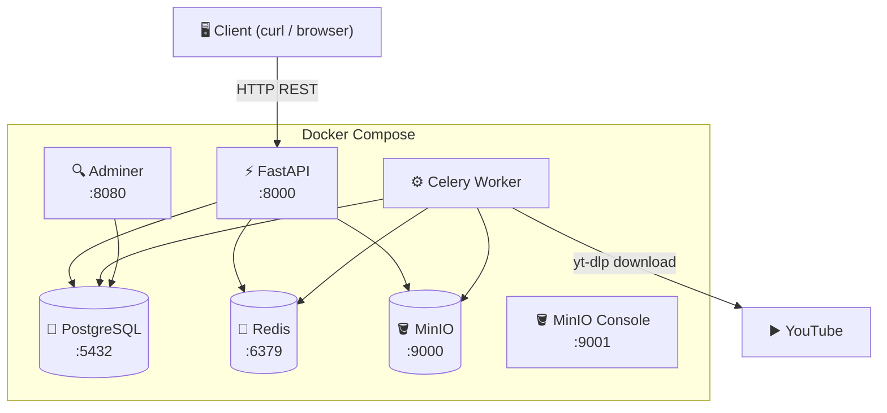
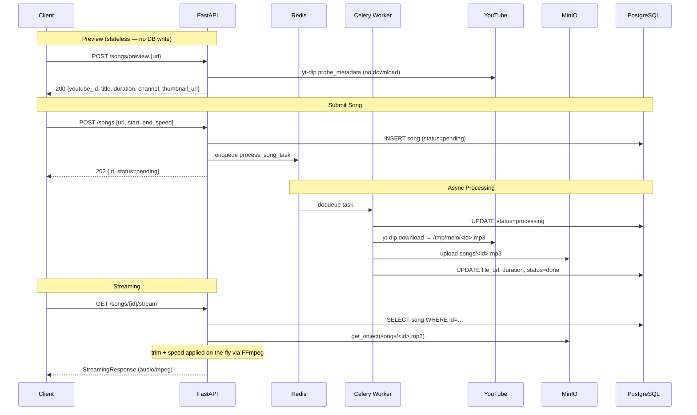
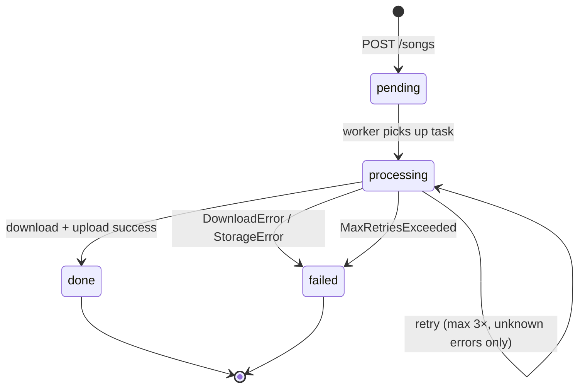
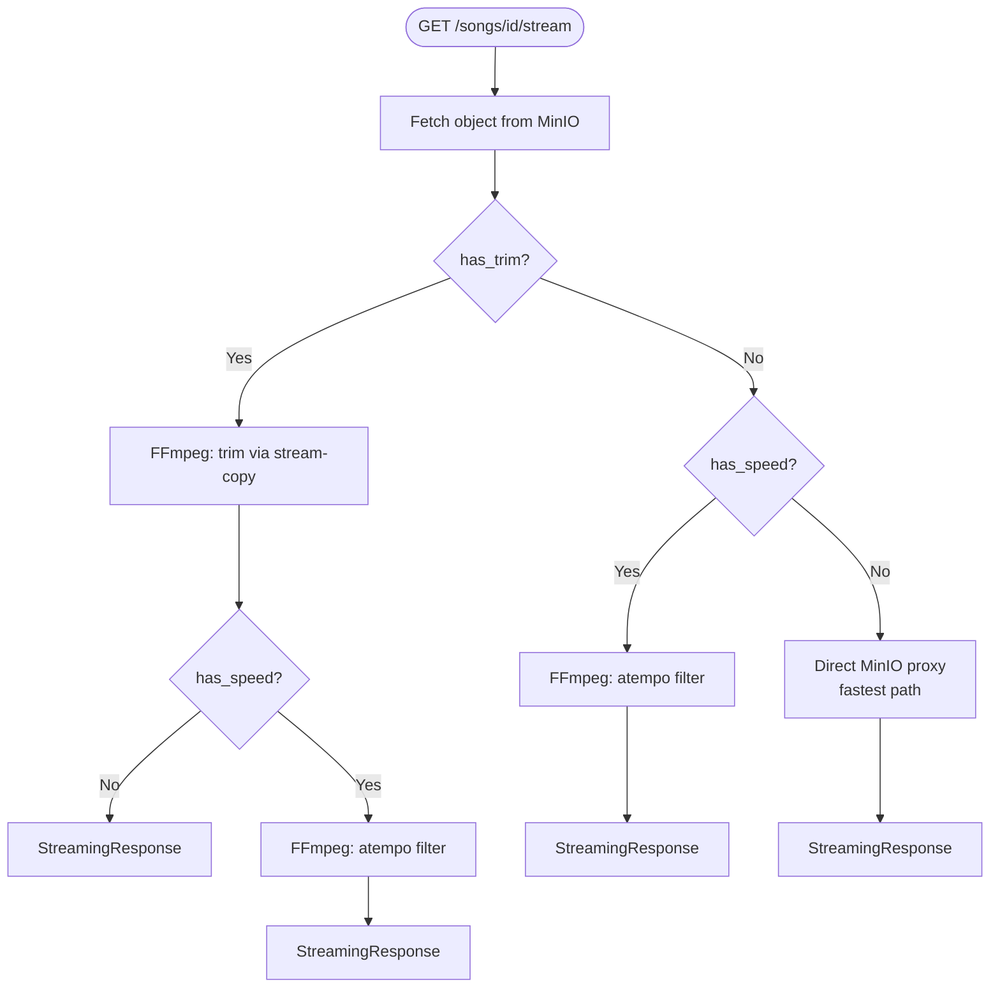
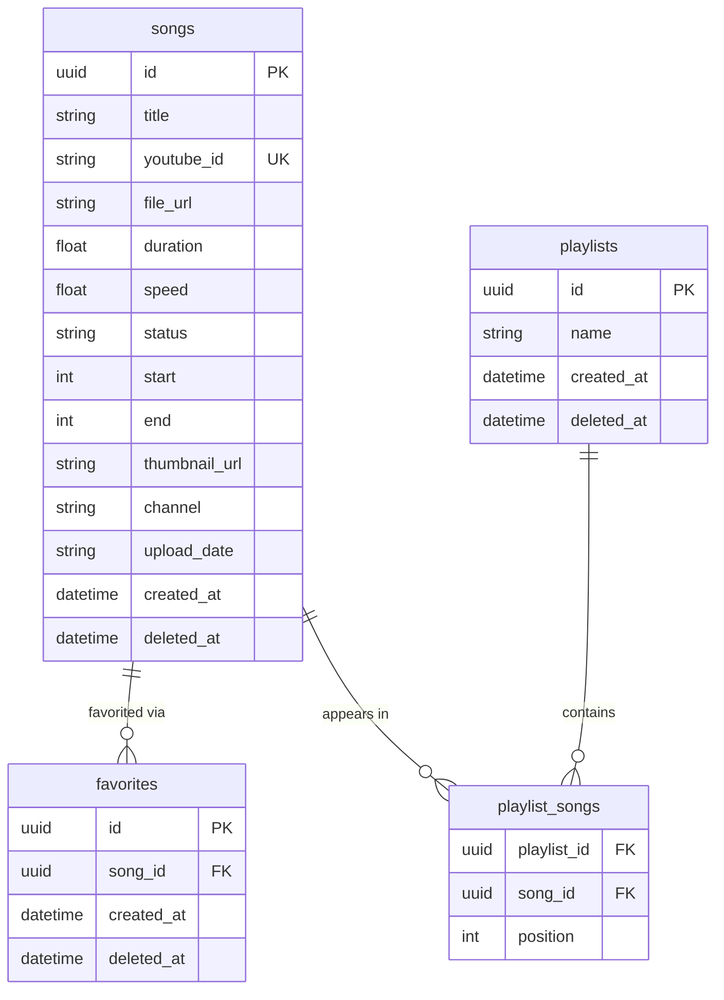
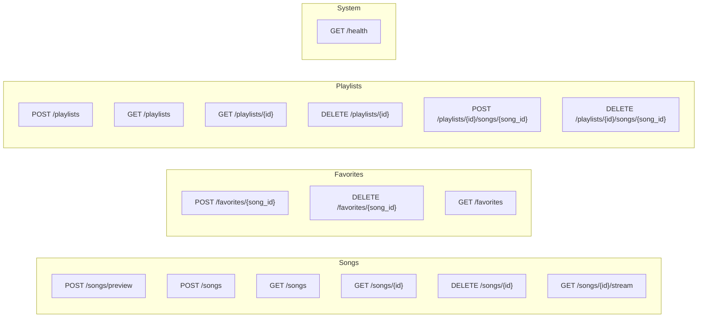

# 🎵 Melo — Architecture

> Personal self-hosted audio library. Paste a YouTube URL → trimmed, speed-adjusted, playable mp3 stored in MinIO.

---

## Stack

| Layer      | Tech                  |
| ---------- | --------------------- |
| API        | FastAPI + Uvicorn     |
| Queue      | Celery + Redis        |
| Download   | yt-dlp                |
| Processing | FFmpeg                |
| Storage    | MinIO (S3-compatible) |
| Database   | PostgreSQL 16         |
| Packaging  | uv                    |
| Runtime    | Docker Compose        |

---

## High-Level System Overview



---

## Request & Async Job Flow



---

## Task State Machine



---

## Stream Pipeline (Case Matrix)

Trim and speed are applied on-the-fly at stream time — no variants stored in MinIO.



| has_trim | has_speed | Behaviour                     |
| -------- | --------- | ----------------------------- |
| ❌        | ❌         | Direct MinIO proxy (fastest)  |
| ✅        | ❌         | Fetch → trim → stream         |
| ❌        | ✅         | Fetch → speed → stream        |
| ✅        | ✅         | Fetch → trim → speed → stream |

**`atempo` chaining** — FFmpeg caps a single `atempo` stage at `[0.5, 2.0]`:

```text
speed=4.0  → atempo=2.0,atempo=2.0
speed=0.25 → atempo=0.5,atempo=0.5
```

---

## Data Model



Notes:
- All PKs are **UUID v7** (via `uuid6` package) — string-sortable = chronological = natural cursor key.
- `favorites.song_id` has a `unique=True` constraint (one row per song).
- `playlist_songs.position` auto-increments on add; same song can appear in multiple playlists.
- `deleted_at` on `songs`, `favorites`, `playlists` — soft delete. `playlist_songs` is hard-deleted (join table, no audit need).
- Indexes on `songs.youtube_id`, `songs.status`, `songs.created_at`, `songs.title` (btree) for dedup and filtering.

---

## API Surface



All responses follow the **envelope format**:

```json
{
  "status_code": 200,
  "message": "…",
  "body": { … }
}
```

Paginated list responses include:

```json
{
  "records": [ … ],
  "count": 42,
  "bookmark": "<last-uuid>"
}
```

`bookmark` enables **cursor-based pagination** via `?after=<uuid>` on `GET /songs`.

---

## Folder Structure

```text
melo/
├── app/
│   ├── api/
│   │   ├── songs.py        # /songs + /songs/preview + /songs/{id}/stream
│   │   ├── favorites.py    # /favorites
│   │   ├── playlists.py    # /playlists
│   │   ├── _song_utils.py  # shared serialize_song + _is_favorited
│   │   └── responses.py    # envelope_response, paginated_response
│   ├── core/
│   │   ├── config.py       # APP_ENV-driven settings
│   │   ├── db.py           # SQLAlchemy engine + session
│   │   ├── deps.py         # FastAPI dependency injection
│   │   ├── logging.py      # structlog setup
│   │   ├── middleware.py   # request logging
│   │   └── exception_handlers.py
│   ├── models/
│   │   ├── song.py         # Song SQLAlchemy model
│   │   ├── favorite.py     # Favorite model
│   │   └── playlist.py     # Playlist + PlaylistSong models
│   ├── schemas/
│   │   ├── song.py         # SongCreate, SongResponse, SongPreviewResponse, …
│   │   ├── playlist.py     # PlaylistCreate, PlaylistResponse, …
│   │   └── envelope.py     # Envelope[T], PaginatedResponse[T]
│   ├── services/
│   │   ├── downloader.py   # yt-dlp: probe_metadata, download_audio
│   │   ├── processor.py    # FFmpeg: trim_audio, apply_speed
│   │   └── storage.py      # MinIO: upload_file, get_presigned_url
│   └── workers/
│       ├── celery_app.py   # Celery app + Redis broker config
│       └── tasks.py        # process_song_task (download → process → upload)
├── tests/
│   ├── unit/               # Mocked, SQLite — no Docker needed
│   └── integration/        # Postgres via pytest-docker
├── docs/
│   └── sprints/
├── docker-compose.yml
├── Dockerfile
├── Makefile
├── pyproject.toml
└── example.env
```

---

## Service Ports

| Service       | URL                        |
| ------------- | -------------------------- |
| API           | http://localhost:8000      |
| API Docs      | http://localhost:8000/docs |
| MinIO Console | http://localhost:9001      |
| Adminer (DB)  | http://localhost:8080      |
| PostgreSQL    | localhost:5432             |
| Redis         | localhost:6379             |

---

## Key Design Decisions

| Decision                                         | Reason                                                              |
| ------------------------------------------------ | ------------------------------------------------------------------- |
| UUID v7 for all PKs                              | String-sortable = chronological = natural cursor key for pagination |
| Cursor pagination on `GET /songs`                | Stable under concurrent inserts; no offset drift                    |
| Speed applied at stream time                     | Avoid storing per-speed variants in MinIO                           |
| Chain `atempo` filters                           | FFmpeg `atempo` capped at `[0.5, 2.0]` per stage                    |
| Trim before speed                                | Correct order — reduces data before re-encoding                     |
| Preview endpoint is stateless                    | No DB writes; simpler system; worker re-probes as source of truth   |
| API proxies MinIO stream                         | Presigned URLs signed to internal hostname break on host rewrite    |
| Favorites idempotent (check-then-insert)         | Solo user; clean UX; avoids upsert complexity                       |
| `is_favorite` queried per song                   | N+1 acceptable at MVP scale                                         |
| Playlist ordering via `position`                 | Predictable playback; auto-increments on add                        |
| `db.expire_all()` after playlist mutations       | Clears stale SQLAlchemy identity map state post-commit              |
| Soft delete on `songs`, `favorites`, `playlists` | Safer than hard delete; preserves audit trail; `deleted_at` column  |
| `playlist_songs` hard delete                     | Join table — no user-facing audit need; position logic unaffected   |
| `_song_utils.py` shared serializer               | Eliminates duplicate `_serialize_song`; avoids circular import      |
| `stream_url` status-driven, never null           | Client polls `GET /songs/{id}` until done, then hits stream         |
| Health check probes Redis + MinIO                | Silent infra failure previously undetectable via `/health`          |
| `docs_url=None` in production                    | Swagger not needed in prod; reduces attack surface                  |
| No Alembic                                       | Solo project; `create_all()` on startup is sufficient               |
| `APP_ENV`-driven env files                       | Clean separation: dev (localhost) / staging (Docker) / prod         |
| `tasks.py` excluded from coverage                | Celery internals require live worker; covered by `make smoke`       |
| Unit test isolation via `_truncate_all()`        | Savepoint rollback unreliable when endpoints call `db.commit()`     |
