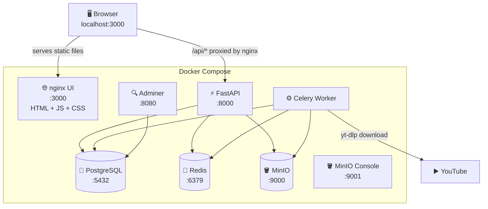
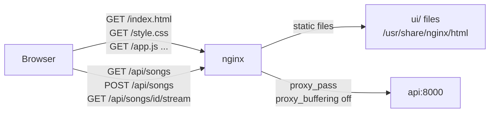
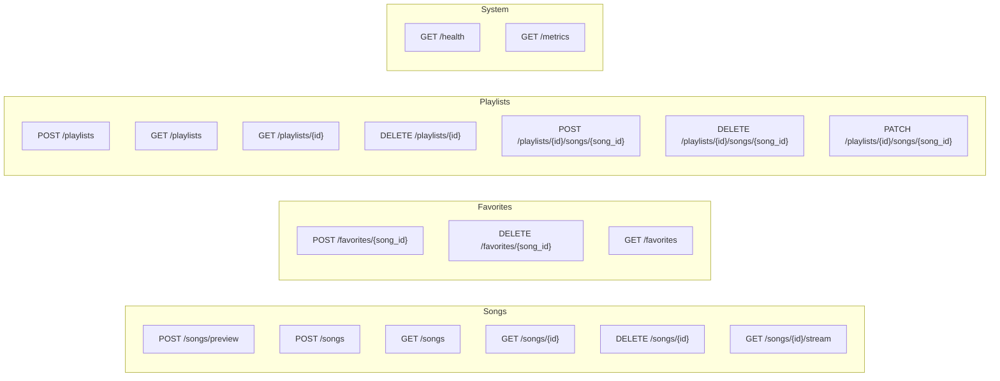

# 🎵 Melo — Architecture

> Personal self-hosted audio library. Paste a YouTube URL → trimmed, speed-adjusted, playable mp3 stored in MinIO.

This document is the index. Detail lives in the linked files — each is scoped to one concern so it can be updated independently of the others.

| Doc                              | Covers                                                                                      |
| -------------------------------- | ------------------------------------------------------------------------------------------- |
| [`SERVICES.md`](./SERVICES.md)   | What each service/module is responsible for — API, worker, UI, downloader/processor/storage |
| [`PIPELINE.md`](./PIPELINE.md)   | Request & async job flow, task state machine, dedup logic, stream pipeline case matrix      |
| [`MODELS.md`](./MODELS.md)       | Data model (ERD), field-level notes, indexes, soft-delete/UUID v7 conventions               |
| [`STORAGE.md`](./STORAGE.md)     | MinIO bucket layout, presigned-URL proxy pattern, log backup storage                        |
| [`INFRA.md`](./INFRA.md)         | Docker Compose services, ports, health checks, Makefile targets, monitoring stack           |
| [`DECISIONS.md`](./DECISIONS.md) | Consolidated decision log across all sprints                                                |
| [`API_DOC.md`](./API_DOC.md)     | Endpoint reference                                                                          |
| [`DESIGN.md`](./DESIGN.md)       | Frontend design spec                                                                        |
| [`USER-FLOW.md`](./USER-FLOW.md) | UI user flows                                                                               |
| [`PROJECT.tree`](./PROJECT.tree) | Current repo tree (`make tree`)                                                             |

---

## Stack

| Layer         | Tech                                                                         |
| ------------- | ---------------------------------------------------------------------------- |
| UI            | Vanilla HTML/JS/CSS                                                          |
| Serving       | nginx                                                                        |
| API           | FastAPI + Uvicorn                                                            |
| Queue         | Celery + Redis                                                               |
| Download      | yt-dlp                                                                       |
| Processing    | FFmpeg                                                                       |
| Storage       | MinIO (S3-compatible)                                                        |
| Database      | PostgreSQL 16                                                                |
| Packaging     | uv                                                                           |
| Runtime       | Docker Compose                                                               |
| Observability | Prometheus, Loki, Tempo, Grafana, Pyroscope (see `INFRA.md`)                 |
| Admin         | Streamlit (`admin/`) — separate app, own theming, see `PRD.md`/`Sprint-5.md` |

---

## High-Level System Overview


```mermaid
graph TD
    Browser["🖥️ Browser\nlocalhost:3000"]

    subgraph Docker Compose
        UI["🌐 nginx UI\n:3000\nHTML + JS + CSS"]
        API["⚡ FastAPI\n:8000"]
        Worker["⚙️ Celery Worker"]
        PG[("🐘 PostgreSQL\n:5432")]
        Redis[("🔴 Redis\n:6379")]
        MinIO[("🪣 MinIO\n:9000")]
        Adminer["🔍 Adminer\n:8080"]
        MinIOConsole["🪣 MinIO Console\n:9001"]
    end

    YT["▶️ YouTube"]

    Browser -->|serves static files| UI
    Browser -->|"/api/* proxied by nginx"| API
    API --> PG
    API --> Redis
    API --> MinIO
    Worker --> PG
    Worker --> Redis
    Worker --> MinIO
    Worker -->|yt-dlp download| YT
    Adminer --> PG
```

> Note: the monitoring stack (Prometheus/Loki/Tempo/Grafana/Pyroscope/exporters/admin) runs as a **separate** Compose file (`infra/docker-compose.monitoring.yml`) layered on top of this one — not shown here. See `INFRA.md`.

---

## nginx Proxy


```mermaid
flowchart LR
    Browser -->|"GET /index.html\nGET /style.css\nGET /app.js ..."| nginx
    Browser -->|"GET /api/songs\nPOST /api/songs\nGET /api/songs/id/stream"| nginx
    nginx -->|static files| dist["ui/ files\n/usr/share/nginx/html"]
    nginx -->|"proxy_pass\nproxy_buffering off"| API["api:8000"]
```

All `/api/*` requests proxied to `api:8000`. `proxy_buffering off` required for audio stream.

---

## Folder Structure

```text
melo/
├── admin/                   # Streamlit admin dashboard (separate app)
├── app/
│   ├── api/                 # songs.py, favorites.py, playlists.py, _song_utils.py, responses.py
│   ├── core/                 # config, db, deps, logging, log_manager, metrics, tracing,
│   │                         #   profiling, pollers, middleware, exception_handlers
│   ├── models/               # song.py, favorite.py, playlist.py
│   ├── schemas/              # song.py, playlist.py, envelope.py
│   ├── services/             # downloader.py, processor.py, storage.py
│   └── workers/              # celery_app.py, tasks.py
├── ui/                       # vanilla JS frontend (see DESIGN.md / USER-FLOW.md)
├── infra/                    # monitoring compose + all provisioning config (see INFRA.md)
├── tests/                    # unit/ + integration/ + smoke scripts
├── docs/                     # this file and its siblings, plus sprint history
├── docker-compose.yml
├── Makefile
└── pyproject.toml
```

See `PROJECT.tree` for the full, current listing.

---

## API Surface

See `API_DOC.md` for the full reference. Summary:


```mermaid
graph LR
    subgraph Songs
        S1["POST /songs/preview"]
        S2["POST /songs"]
        S3["GET /songs"]
        S4["GET /songs/{id}"]
        S5["DELETE /songs/{id}"]
        S6["GET /songs/{id}/stream"]
    end

    subgraph Favorites
        F1["POST /favorites/{song_id}"]
        F2["DELETE /favorites/{song_id}"]
        F3["GET /favorites"]
    end

    subgraph Playlists
        P1["POST /playlists"]
        P2["GET /playlists"]
        P3["GET /playlists/{id}"]
        P4["DELETE /playlists/{id}"]
        P5["POST /playlists/{id}/songs/{song_id}"]
        P6["DELETE /playlists/{id}/songs/{song_id}"]
        P7["PATCH /playlists/{id}/songs/{song_id}"]
    end

    subgraph System
        H["GET /health"]
        M["GET /metrics"]
    end
```

All responses follow the envelope format except `/songs/{id}/stream`, `/metrics`, `/health` is enveloped (see `API_DOC.md`).
