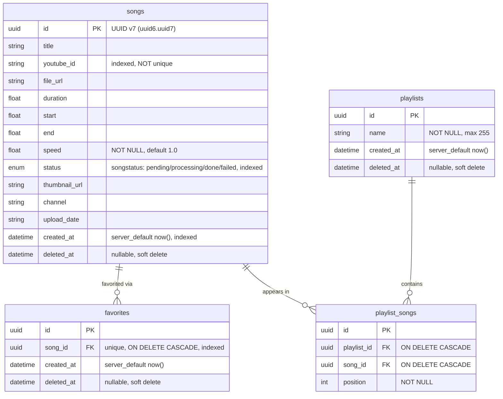

# Melo — Data Model

> Verified against `app/models/song.py`, `app/models/favorite.py`, `app/models/playlist.py`.

---

## ERD

---

## Field Notes

### `Song`

- PK is UUID v7 (`uuid6.uuid7`, default at insert) — string-sortable = chronologically sortable = usable as a cursor pagination key with no separate ordering column needed.
- `youtube_id` is indexed but **not unique** — this is intentional (see Dedup logic in `PIPELINE.md`): the same video can have multiple `Song` rows with different `start`/`end`/`speed`, and the worker dedups by finding an existing `done` row with a matching `youtube_id` rather than relying on a DB constraint.
- `speed` is `NOT NULL` with a Python-level default of `1.0` (no `server_default`) — always present on insert via the ORM.
- `status` is a Postgres `Enum` type named `songstatus`, both indexed and given a `server_default` of `"pending"` — so a raw `INSERT` without going through the ORM would still default correctly.
- `thumbnail_url`, `channel`, `upload_date` are nullable and populated asynchronously by the worker's metadata probe — a record is queryable via `GET /songs/{id}` immediately after insert, before any of these fields are filled in.
- **GIN trigram index** (`ix_songs_title_trgm`, `postgresql_using="gin"`, `gin_trgm_ops`) on `title` — supports the case-insensitive, leading-**and**-trailing `ILIKE '%search%'` query used by `GET /songs?search=`. This requires the `pg_trgm` Postgres extension, which `app/core/db.py`'s `_create_pg_extensions()` creates (`CREATE EXTENSION IF NOT EXISTS pg_trgm`) before `create_all()` runs. The extension step is skipped entirely on SQLite, so unit tests running against SQLite are unaffected.
- `created_at` is both indexed and the default sort key for pagination.

### `Favorite`

- `song_id` has both a **unique constraint** and `ON DELETE CASCADE` — a hard delete of a `Song` row (which doesn't happen in normal operation; songs are soft-deleted) would cascade-delete its favorite row too.
- Soft-deleted (not active) favorite rows can exist alongside an attempt to re-favorite — `POST /favorites/{song_id}` checks for *any* row (active or soft-deleted) before inserting, and reactivates a soft-deleted row rather than violating the unique constraint with a fresh insert. See `API_DOC.md` for the idempotency behavior this produces.

### `Playlist` / `PlaylistSong`

- `Playlist.playlist_songs` relationship: `cascade="all, delete-orphan"`, ordered by `PlaylistSong.position`.
- `Playlist.songs` is a **viewonly** secondary relationship through `playlist_songs`, also ordered by `position` — convenient read-only access to the songs without needing to manually join.
- `PlaylistSong` has two unique constraints: `uq_playlist_song` (a song can't appear twice in the same playlist) and `uq_playlist_position` (no two songs in the same playlist share a position). The API's `add_song_to_playlist` route retries position assignment up to 3× and inspects which constraint fired on an `IntegrityError` to decide whether to return "already in playlist" (200) or retry/409.
- `PlaylistSong` has **no** `deleted_at` — it's the one hard-deleted table in the schema (a join row with no audit need), consistent with `DELETE /playlists/{id}/songs/{song_id}` doing `db.delete(entry)` rather than a soft delete.

---

## Soft Delete Convention

`songs`, `favorites`, and `playlists` all follow the same pattern: `deleted_at: datetime | None`, set to `datetime.now(UTC)` on delete rather than removing the row. Every `GET`/list query in the API filters `.filter(Model.deleted_at.is_(None))`. There is no Alembic migration tool in this project — `Base.metadata.create_all(bind=engine, checkfirst=True)` runs at startup (`init_db()` in `app/core/db.py`), so this soft-delete column is just part of the model definition rather than a migration.

## No Alembic

Confirmed in `app/core/db.py`: `init_db()` calls `Base.metadata.create_all(checkfirst=True)` directly; `reset_db()` (test-only) drops and recreates all tables. This is a deliberate solo-project tradeoff — see `DECISIONS.md`.
