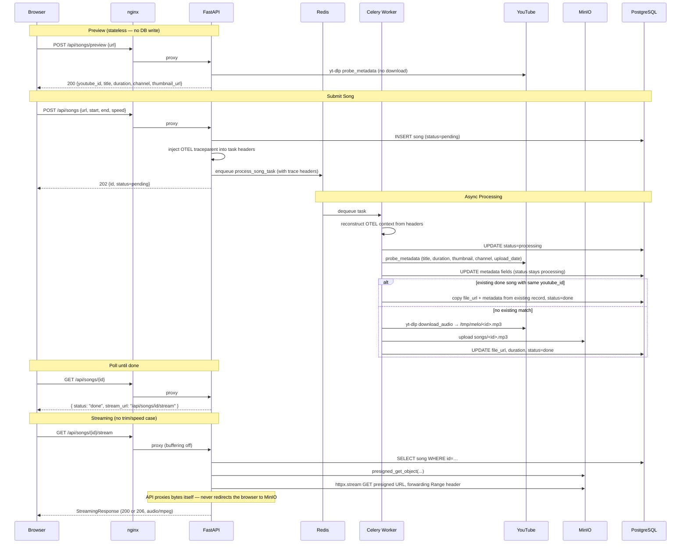
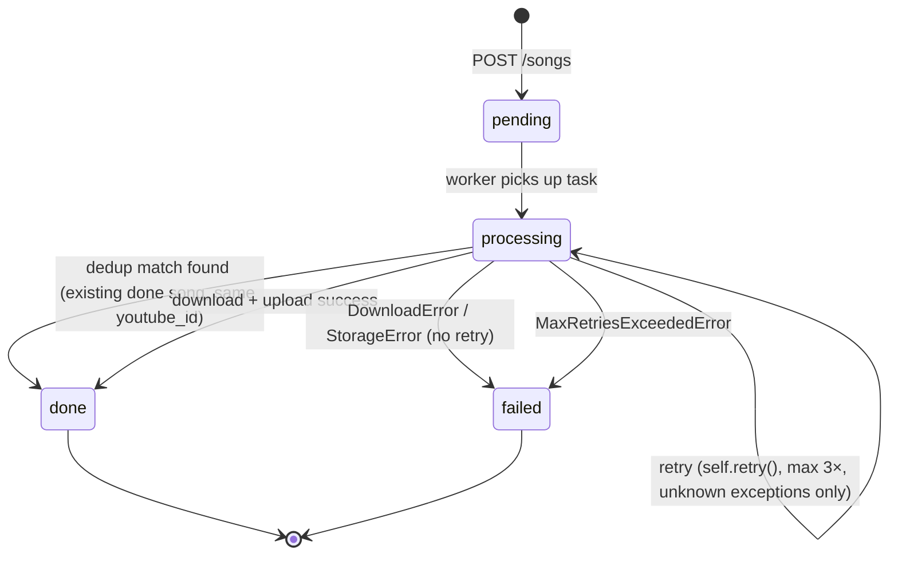
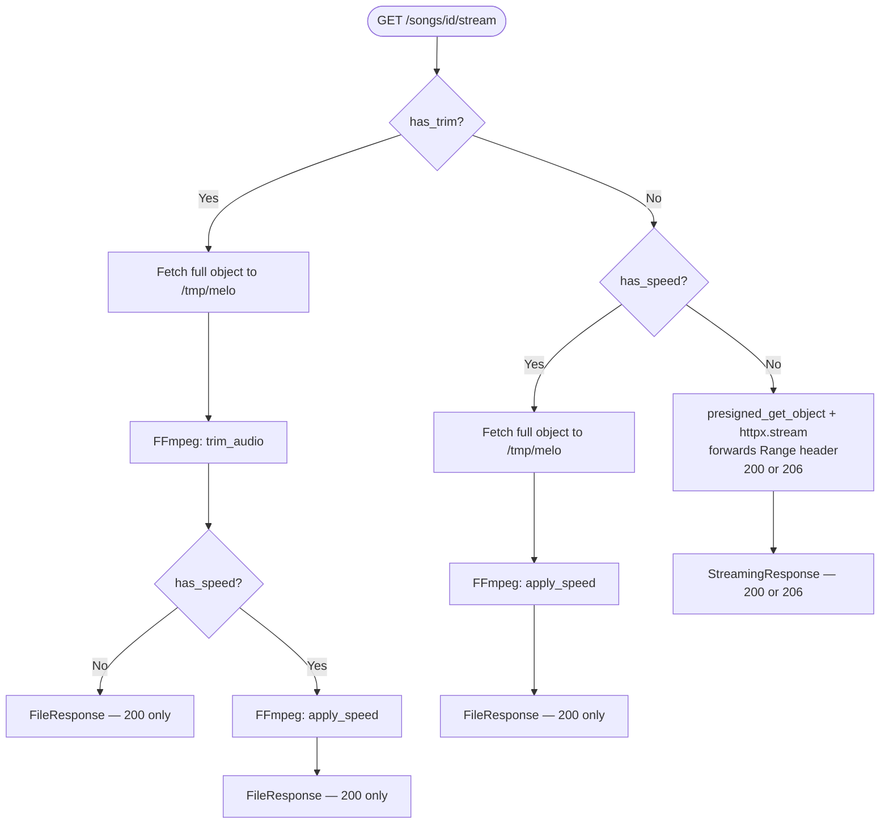

# Melo — Pipeline

> Request & async job flow, task state machine, dedup logic, and the stream-time processing matrix.

---

## Request & Async Job Flow

---

## Task State Machine

Notes (from `app/workers/tasks.py`):
- `DownloadError`/`StorageError` mark the song `failed` immediately — **no retry** for these.
- Any other exception triggers `self.retry(exc=exc)` (Celery-native retry, `default_retry_delay=10`, `max_retries=3`); once retries are exhausted, `MaxRetriesExceededError` is caught and the song is marked `failed`.
- `_mark_failed()` is best-effort: if the DB commit itself fails while marking a song failed, the exception is swallowed and logged (`mark_failed_error`) rather than propagated, so a broken DB connection during error handling doesn't crash the task twice.
- The downloaded temp file (`local_path`) is always cleaned up in a `finally` block regardless of outcome.
- `songs_completed_total{status="done"|"failed"}` is incremented on every terminal transition (including the dedup path).

---

## Dedup Logic

When a song is submitted with a `youtube_id` that already has a **`done`** record (different `start`/`end`/`speed` — the API always inserts a new row, never rejects with 409), the worker:

1. Still probes metadata fresh for the new record (so `title`/`duration`/etc. are populated even in the dedup path).
2. Looks up an existing `Song` with the same `youtube_id`, `status == done`, and a different `id`.
3. If found: copies `file_url`, `duration`, `title`, `thumbnail_url`, `channel`, `upload_date` from the existing record onto the new one, sets `status = done`, and returns immediately — **no download, no MinIO upload.**
4. If not found: proceeds to `download_audio` → `upload_file` as normal.

This means multiple `Song` rows can point at the same MinIO object (`file_url`), each with its own trim/speed applied at stream time.

---

## Stream Pipeline (Case Matrix)

Trim and speed are applied on-the-fly at stream time — no variants stored in MinIO. Source: `GET /songs/{id}/stream` in `app/api/songs.py`.

| `start/end` set? | `speed != 1.0`? | Behaviour                                                     | Status codes  |
| ---------------- | --------------- | ------------------------------------------------------------- | ------------- |
| ❌                | ❌               | Presigned MinIO fetch, proxied via `httpx`, `Range` forwarded | `200` / `206` |
| ✅                | ❌               | Fetch → `trim_audio` → `FileResponse`                         | `200` only    |
| ❌                | ✅               | Fetch → `apply_speed` → `FileResponse`                        | `200` only    |
| ✅                | ✅               | Fetch → `trim_audio` → `apply_speed` → `FileResponse`         | `200` only    |

- Range/partial-content (`206`) is **only** available on the no-trim/no-speed path, since that's the only case not re-encoded through FFmpeg to a local file first.
- `FileResponse` cases use a `BackgroundTask` to delete all intermediate temp files (original/trimmed/speed-adjusted) after the response finishes, and observe `stream_duration_seconds` in that same cleanup callback.
- The proxy path (`DirectProxy`) generates a presigned URL via `client.presigned_get_object` directly and streams bytes itself with `httpx` — it does **not** redirect the browser to MinIO. See `STORAGE.md` for why.
- `atempo` chaining: FFmpeg caps a single `atempo` stage at `[0.5, 2.0]`, so `speed=4.0` → `atempo=2.0,atempo=2.0` and `speed=0.25` → `atempo=0.5,atempo=0.5`. Trim always runs before speed (reduces data before re-encoding).

---

## Distributed Tracing Through the Pipeline

- `POST /songs` injects the current OTEL `traceparent` into the Celery task's headers (`_inject_trace_context_into_task` in `songs.py`, via `opentelemetry.propagate.inject`), falling back to a plain `.delay()` call if injection fails for any reason.
- `process_song_task` reconstructs that context on the worker side (`_trace_context` contextmanager in `tasks.py`, via `opentelemetry.propagate.extract`) and opens a child span `celery.process_song` inside it — so the HTTP request span and the async task span appear in the same trace in Tempo.
- `X-Trace-Id` is injected into every API response by `TraceIdMiddleware` (`app/core/tracing.py`), and the same trace ID is attached to every structlog record for log↔trace correlation in Grafana.
