# Melo — User Flow

> How a user moves through the app from first open to organized library.

---

## App Entry

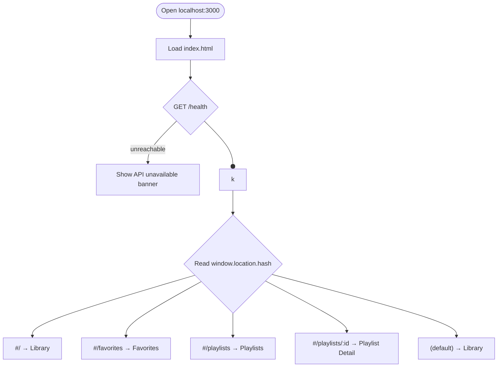

---

## 1. Library Page

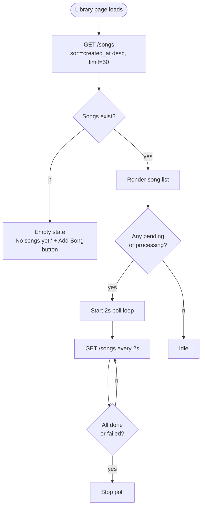

### 1a. Filter / Search / Sort

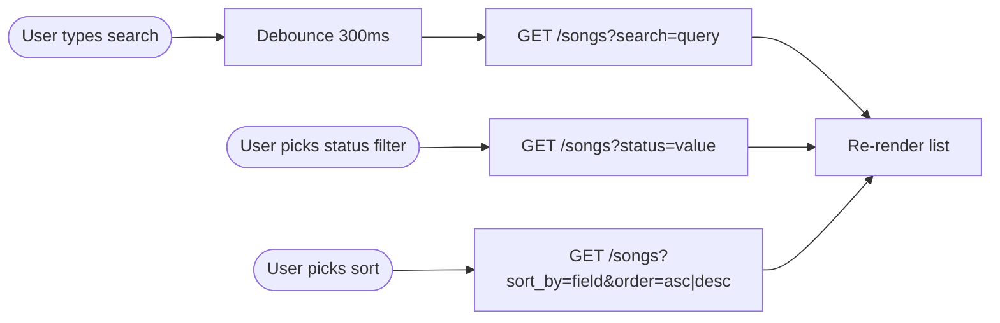

### 1b. Pagination

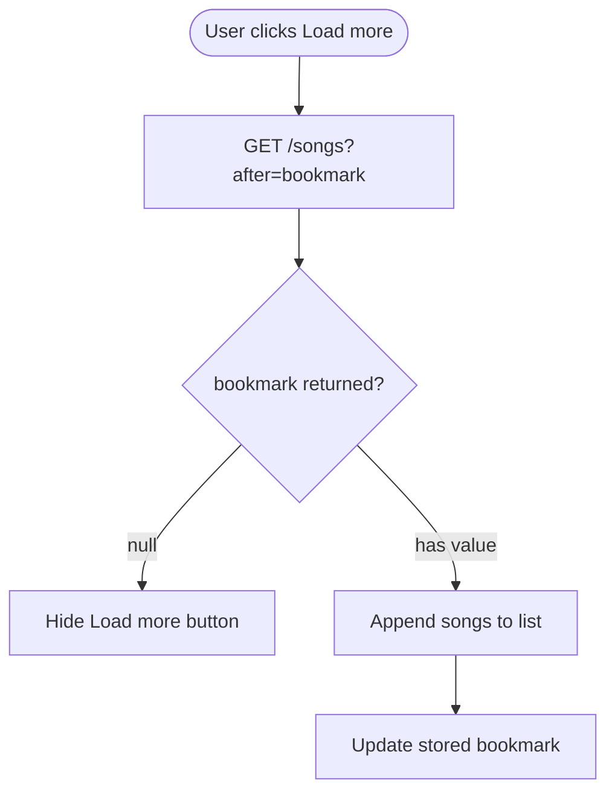

---

## 2. Add Song Flow

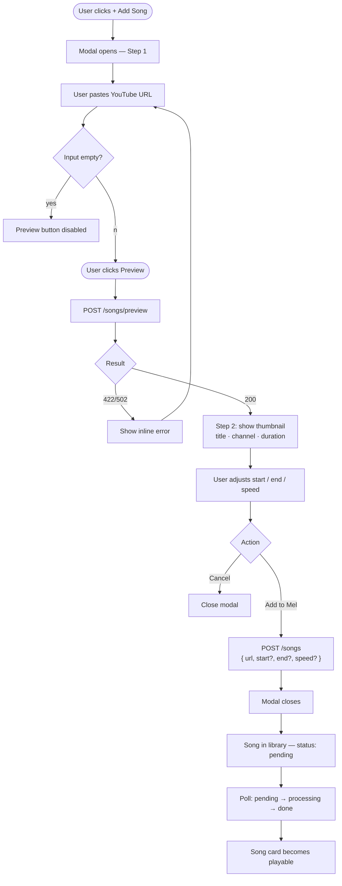

---

## 3. Play a Song

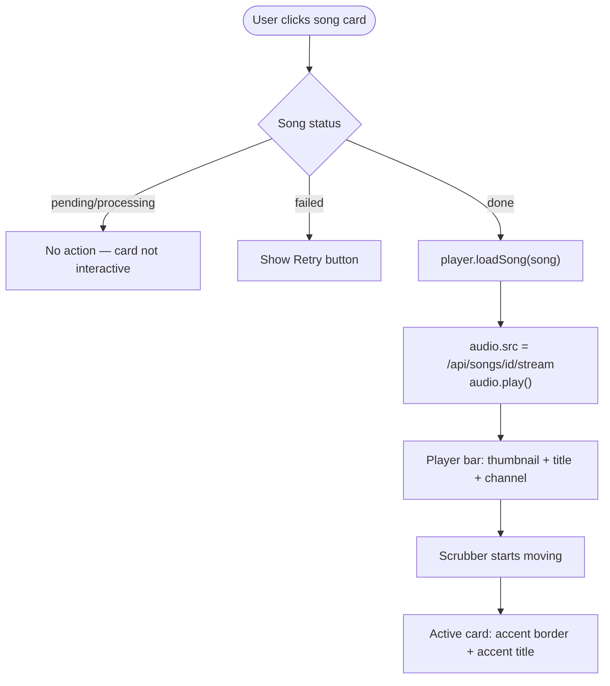

### 3a. Player Controls

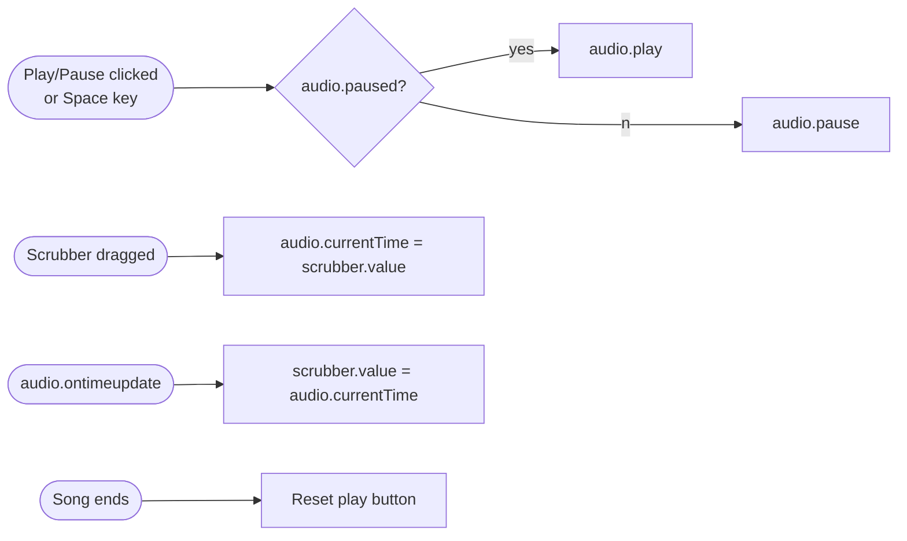

---

## 4. Favorite Toggle

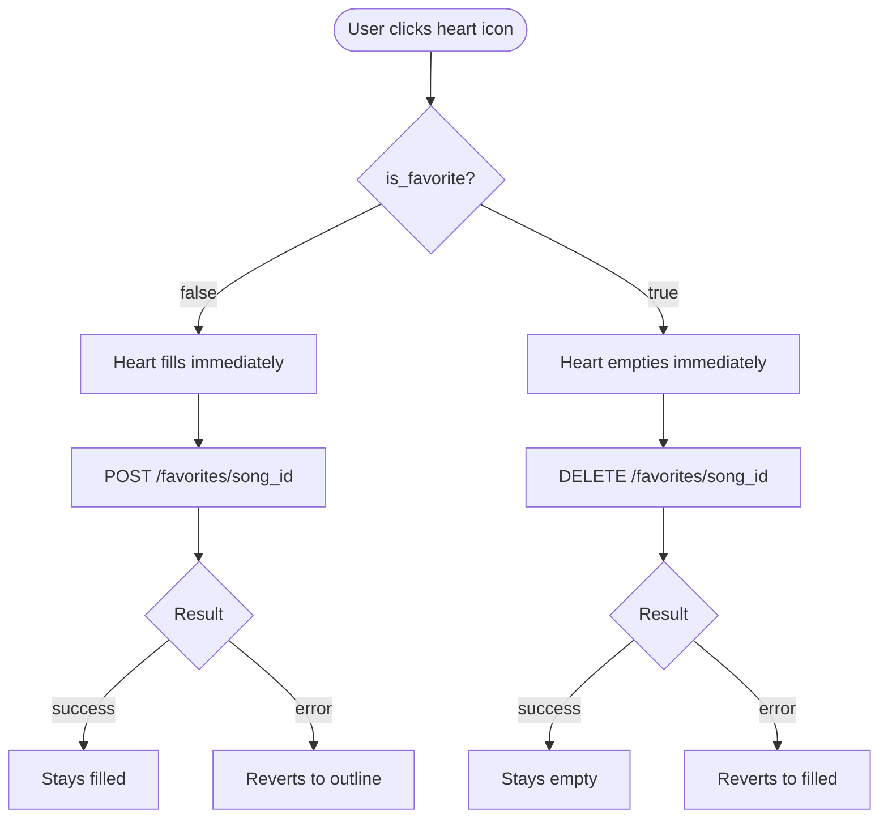

---

## 5. Favorites Page

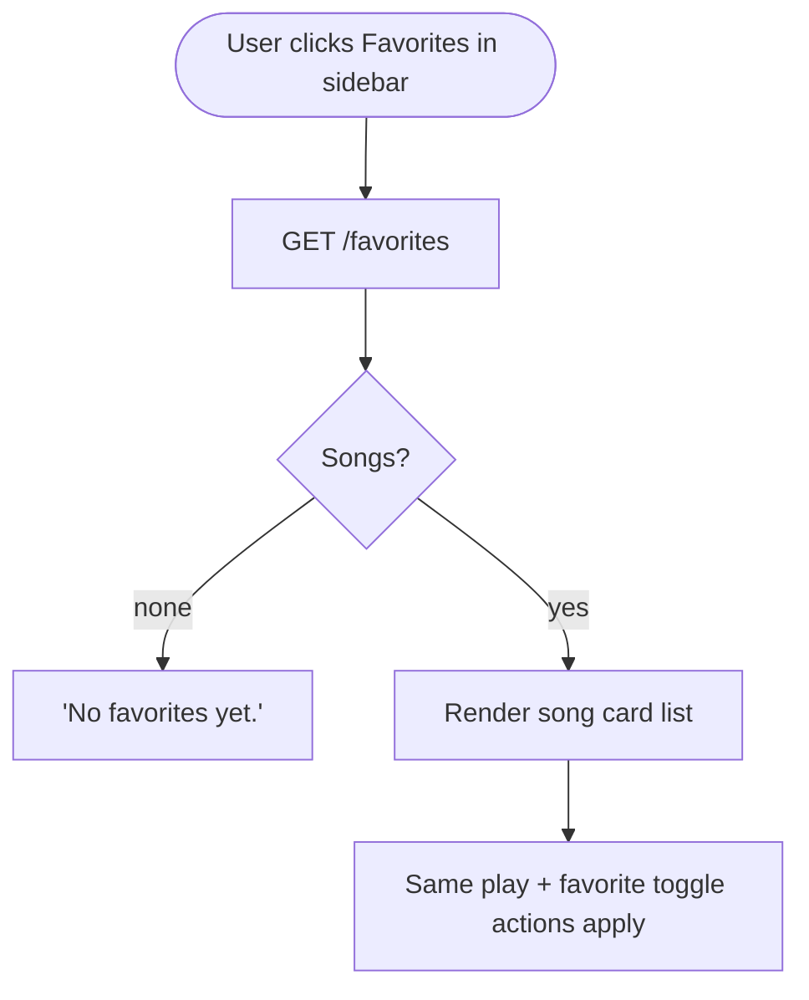

---

## 6. Playlists Page

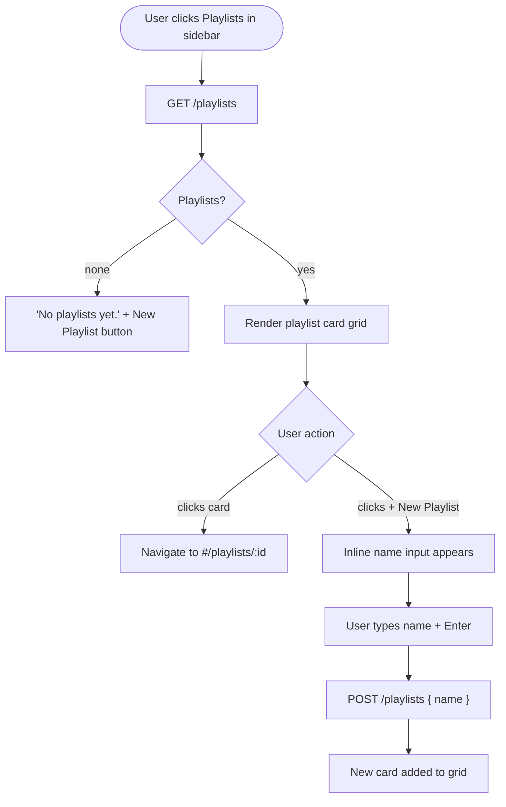

---

## 7. Playlist Detail Page

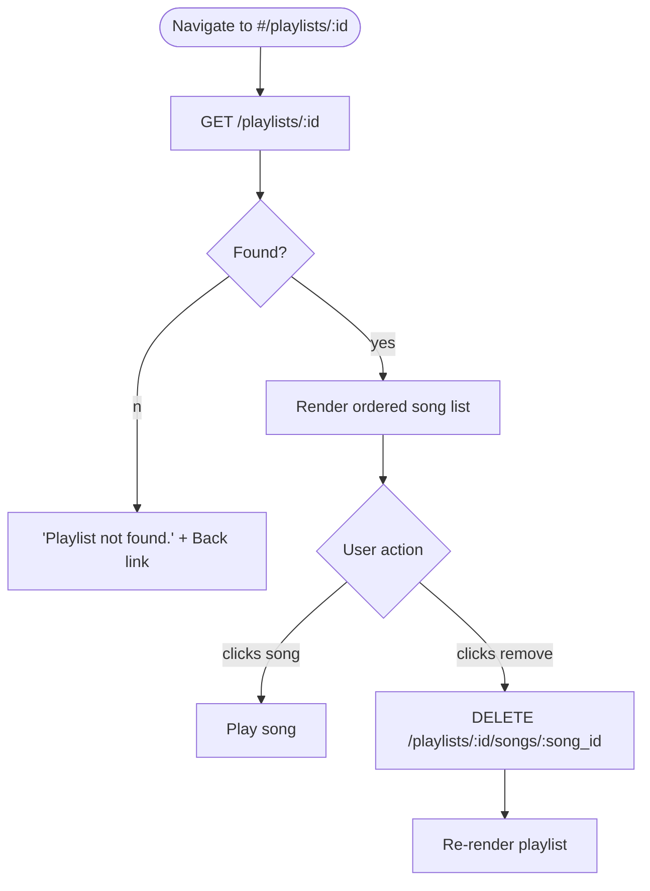

---

## 8. Add Song to Playlist

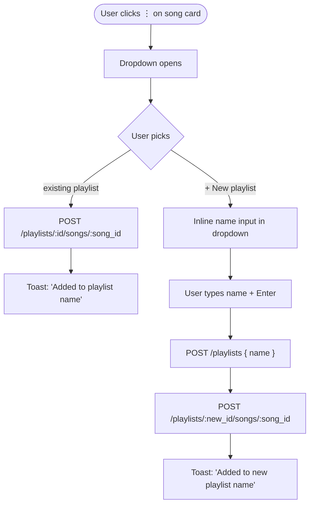

---

## 9. Delete a Song

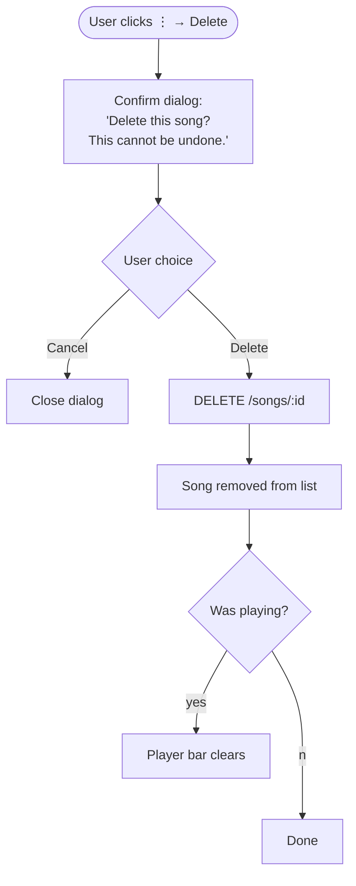

---

## 10. Error States

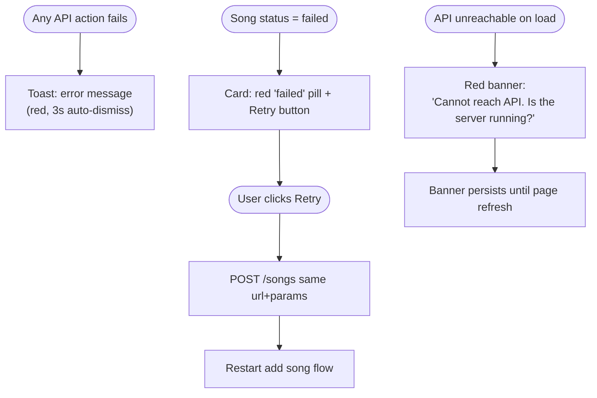

---

## Navigation Overview

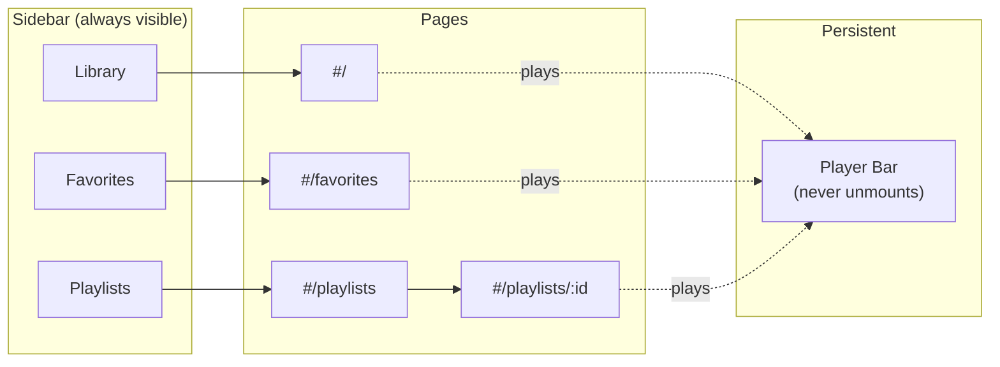

---

## Keyboard Shortcuts

| Key     | Action                                   |
| ------- | ---------------------------------------- |
| `Space` | Play / pause current song                |
| `Esc`   | Close modal or dropdown                  |
| `Enter` | Submit inline input (playlist name, URL) |
