# Melo — User Flow

> How a user moves through the app from first open to organized library.

> **Sprint 6 note:** nav, player, and playlist-detail flows below were extended for responsive layout (phone/tablet/desktop), extra player controls (volume/shuffle/loop/queue), the Now Playing panel, and drag-reorder. Sections marked "(Sprint 6)" are new since the original doc; unmarked sections are unchanged from Sprint 4.

---

## App Entry

Health check and hash routing run **concurrently**, not sequentially — `checkApiHealth()` is fired without `await` in `bootstrap()`, so the app renders the current route immediately rather than waiting on `/health` first.

```mermaid
flowchart TD
    A([Open localhost:3000]) --> B[Load index.html]
    B --> C[bootstrap: bind player + global events]
    C --> D["checkApiHealth() — fire and forget"]
    C --> E{Read window.location.hash}
    D --unreachable--> F[Show API unavailable banner\n— appears whenever it resolves]
    D --ok/degraded--> G[No banner, or degraded-services banner]
    E --> H["#/ → Library"]
    E --> I["#/favorites → Favorites"]
    E --> J["#/playlists → Playlists"]
    E --> K["#/playlists/:id → Playlist Detail"]
    E --> L["(default) → Library"]
```

---

## 1. Library Page

```mermaid
flowchart TD
    A([Library page loads]) --> B["GET /songs\nsort_by=created_at, order=desc, limit=50"]
    B --> C{Songs exist?}
    C --no--> D["Empty state\n'No songs yet.' + Add Song button"]
    C --yes--> E[Render song list]
    E --> F{Any pending\nor processing?}
    F --yes--> G[Start 2s poll loop]
    G --> H["GET /songs every 2s"]
    H --> I{All done\nor failed?}
    I --no--> H
    I --yes--> J[Stop poll]
    F --no--> K[Idle]
```

### 1a. Filter / Search / Sort

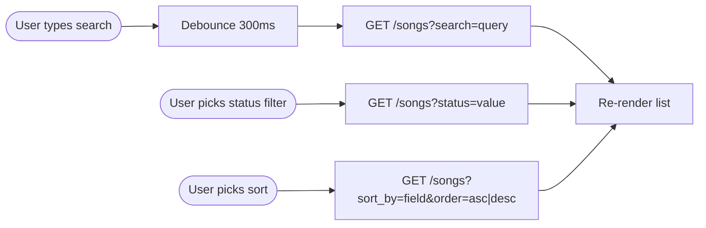
```mermaid
flowchart LR
    A([User types search]) --> B[Debounce 300ms]
    B --> C["GET /songs?search=query"]
    C --> D[Re-render list]

    E([User picks status filter]) --> F["GET /songs?status=value"]
    F --> D

    G([User picks sort]) --> H["GET /songs?sort_by=field&order=asc|desc"]
    H --> D
```

### 1b. Pagination

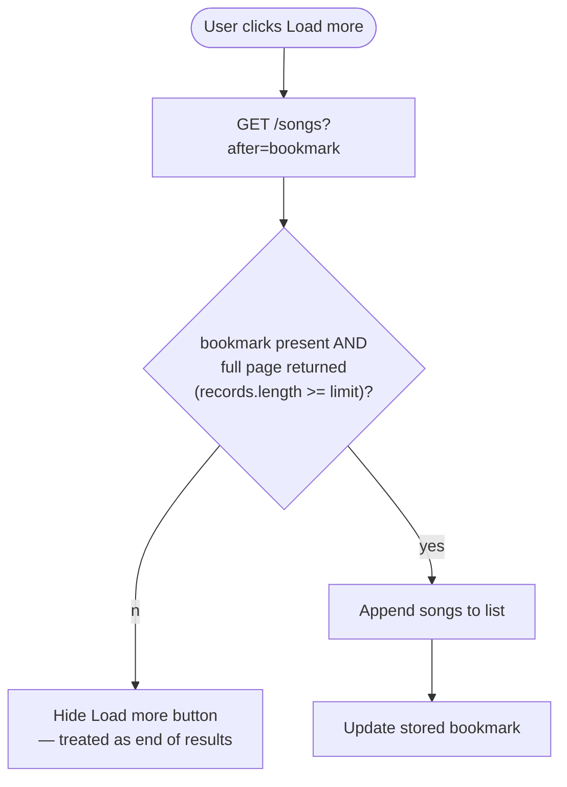
```mermaid
flowchart TD
    A([User clicks Load more]) --> B["GET /songs?after=bookmark"]
    B --> C{"bookmark present AND\nfull page returned\n(records.length >= limit)?"}
    C --no--> D[Hide Load more button\n— treated as end of results]
    C --yes--> E[Append songs to list]
    E --> F[Update stored bookmark]
```

> A non-null `bookmark` alone isn't enough to keep paging — a short page (fewer records than `limit`) is also treated as the end, even if the API returned a bookmark.

---

## 2. Add Song Flow

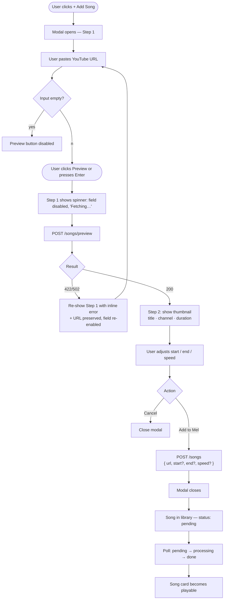
```mermaid
flowchart TD
    A([User clicks + Add Song]) --> B[Modal opens — Step 1]
    B --> C[User pastes YouTube URL]
    C --> D{Input empty?}
    D --yes--> E[Preview button disabled]
    D --no--> F([User clicks Preview or presses Enter])
    F --> G[Step 1 shows spinner: field disabled, 'Fetching…']
    G --> H["POST /songs/preview"]
    H --> I{Result}
    I --422/502--> J[Re-show Step 1 with inline error\n+ URL preserved, field re-enabled]
    J --> C
    I --200--> K[Step 2: show thumbnail\ntitle · channel · duration]
    K --> L[User adjusts start / end / speed]
    L --> M{Action}
    M --Cancel--> N[Close modal]
    M --Add to Melo--> O["POST /songs\n{ url, start?, end?, speed? }"]
    O --> P[Modal closes]
    P --> Q[Song in library — status: pending]
    Q --> R[Poll: pending → processing → done]
    R --> S[Song card becomes playable]
```

---

## 3. Play a Song

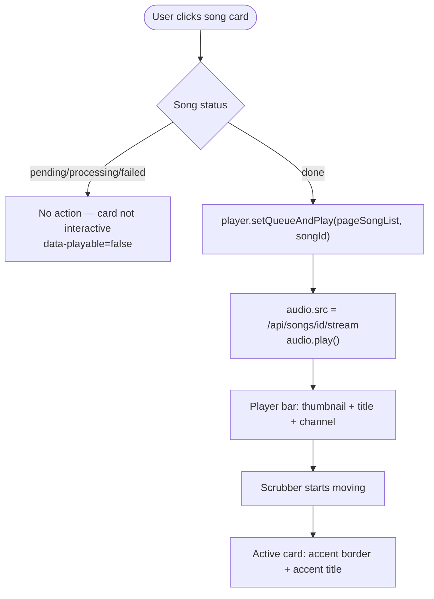
```mermaid
flowchart TD
    A([User clicks song card]) --> B{Song status}
    B --pending/processing/failed--> C[No action — card not interactive\ndata-playable=false]
    B --done--> D["player.setQueueAndPlay(pageSongList, songId)"]
    D --> E["audio.src = /api/songs/id/stream\naudio.play()"]
    E --> F[Player bar: thumbnail + title + channel]
    F --> G[Scrubber starts moving]
    G --> H[Active card: accent border + accent title]
```

> The **Retry** button on failed songs is a separate always-visible control next to the status pill, not something surfaced by clicking the card.

> **(Sprint 6)** Clicking a card sets the player's **queue** to whatever song list is currently rendered on screen (Library/Favorites/Playlist Detail — whichever is visible), positioned at the clicked song. This queue is what Prev/Next/Shuffle/Loop operate on — it is not refetched from the API, it's just the list already on screen.

### 3a. Player Controls

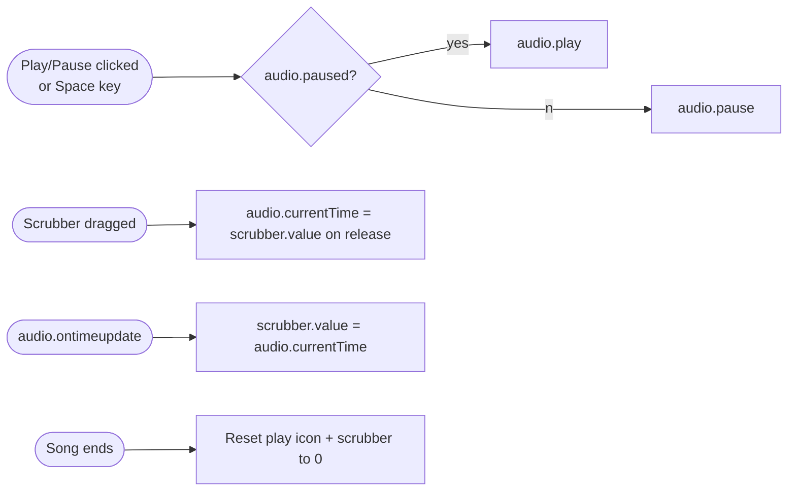
```mermaid
flowchart LR
    A([Play/Pause clicked\nor Space key]) --> B{audio.paused?}
    B --yes--> C[audio.play]
    B --no--> D[audio.pause]

    E([Scrubber dragged]) --> F[audio.currentTime = scrubber.value on release]
    G([audio.ontimeupdate]) --> H[scrubber.value = audio.currentTime]

    I([Song ends]) --> J[Reset play icon + scrubber to 0]
```

> Space only toggles play/pause when focus isn't on an `<input>` or `<select>`.

> **(Sprint 6)** Scrubber fill is colored `--accent` up to the playhead via a `--progress` CSS var set on every tick — purely visual, doesn't change the seek behavior above.

### 3b. Prev / Next / Shuffle / Loop (Sprint 6)

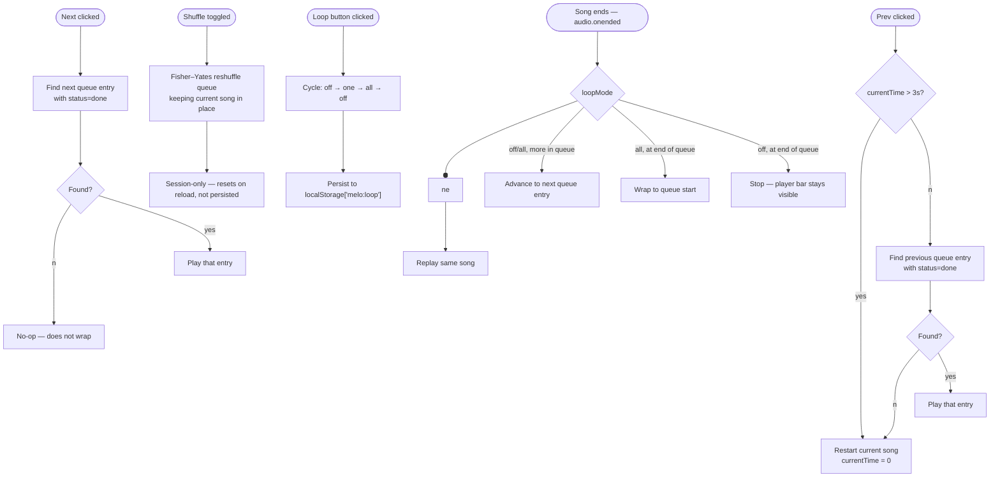
```mermaid
flowchart TD
    A([Next clicked]) --> B["Find next queue entry\nwith status=done"]
    B --> C{Found?}
    C --no--> D[No-op — does not wrap]
    C --yes--> E[Play that entry]

    F([Prev clicked]) --> G{"currentTime > 3s?"}
    G --yes--> H[Restart current song\ncurrentTime = 0]
    G --no--> I["Find previous queue entry\nwith status=done"]
    I --> J{Found?}
    J --no--> H
    J --yes--> K[Play that entry]

    L([Shuffle toggled]) --> M["Fisher–Yates reshuffle queue\nkeeping current song in place"]
    M --> N[Session-only — resets on reload, not persisted]

    O([Loop button clicked]) --> P["Cycle: off → one → all → off"]
    P --> Q["Persist to localStorage['melo:loop']"]

    R([Song ends — audio.onended]) --> S{loopMode}
    S --one--> T[Replay same song]
    S --"off/all, more in queue"--> U[Advance to next queue entry]
    S --"all, at end of queue"--> V[Wrap to queue start]
    S --"off, at end of queue"--> W[Stop — player bar stays visible]
```

> Next/Prev/Shuffle/Loop all skip queue entries whose `status !== 'done'` (e.g. still `pending`/`processing` next to a playable song in the list).

### 3c. Volume (Sprint 6)

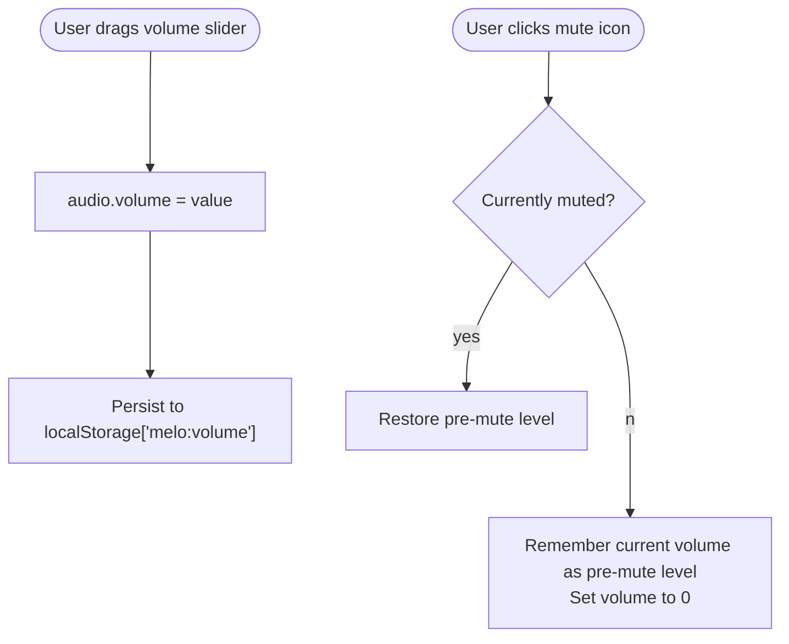
```mermaid
flowchart TD
    A([User drags volume slider]) --> B["audio.volume = value"]
    B --> C["Persist to localStorage['melo:volume']"]

    D([User clicks mute icon]) --> E{Currently muted?}
    E --no--> F[Remember current volume as pre-mute level\nSet volume to 0]
    E --yes--> G[Restore pre-mute level]
```

### 3d. Now Playing Panel (Sprint 6)

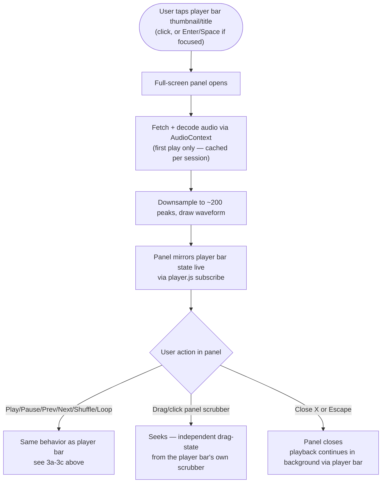
```mermaid
flowchart TD
    A(["User taps player bar thumbnail/title\n(click, or Enter/Space if focused)"]) --> B[Full-screen panel opens]
    B --> C["Fetch + decode audio via AudioContext\n(first play only — cached per session)"]
    C --> D[Downsample to ~200 peaks, draw waveform]
    D --> E[Panel mirrors player bar state live\nvia player.js subscribe]
    E --> F{User action in panel}
    F --Play/Pause/Prev/Next/Shuffle/Loop--> G[Same behavior as player bar\nsee 3a-3c above]
    F --Drag/click panel scrubber--> H[Seeks — independent drag-state\nfrom the player bar's own scrubber]
    F --Close X or Escape--> I[Panel closes\nplayback continues in background via player bar]
```

> Waveform bars recolor `--accent` (played) vs `--bg-elevated` (unplayed) live as the song progresses. Clicking directly on the waveform does **not** seek — only the separate scrubber control below it does.

---

## 4. Favorite Toggle

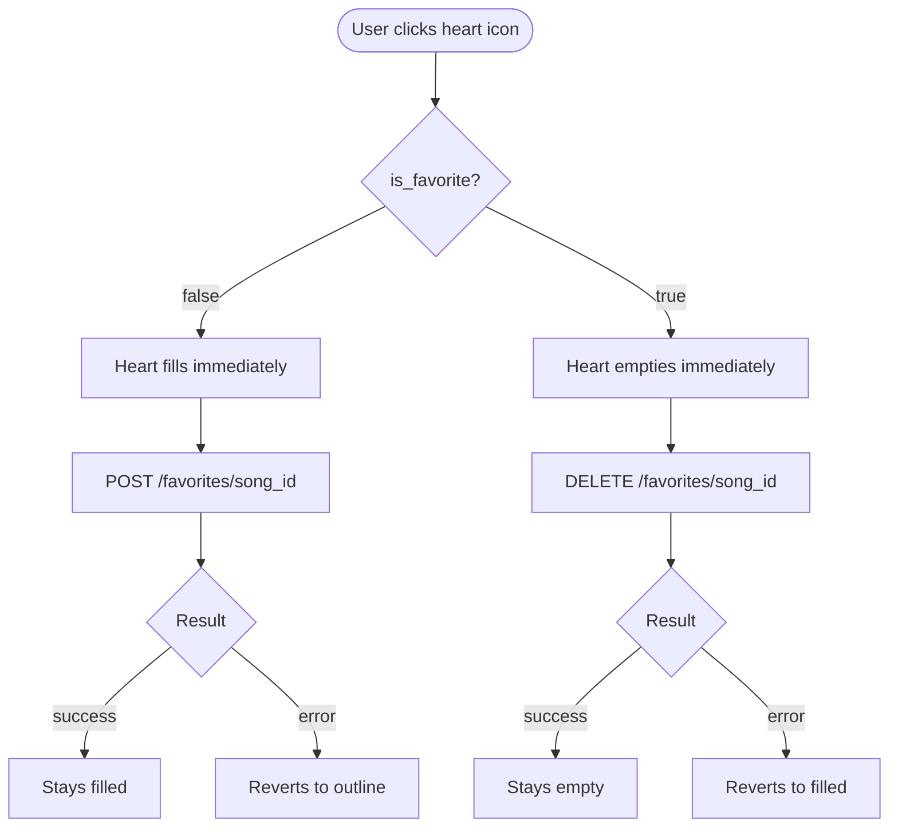
```mermaid
flowchart TD
    A([User clicks heart icon]) --> B{is_favorite?}
    B --false--> C[Heart fills immediately]
    C --> D["POST /favorites/song_id"]
    D --> E{Result}
    E --success--> F[Stays filled]
    E --error--> G[Reverts to outline]

    B --true--> H[Heart empties immediately]
    H --> I["DELETE /favorites/song_id"]
    I --> J{Result}
    J --success--> K[Stays empty]
    J --error--> L[Reverts to filled]
```

---

## 5. Favorites Page

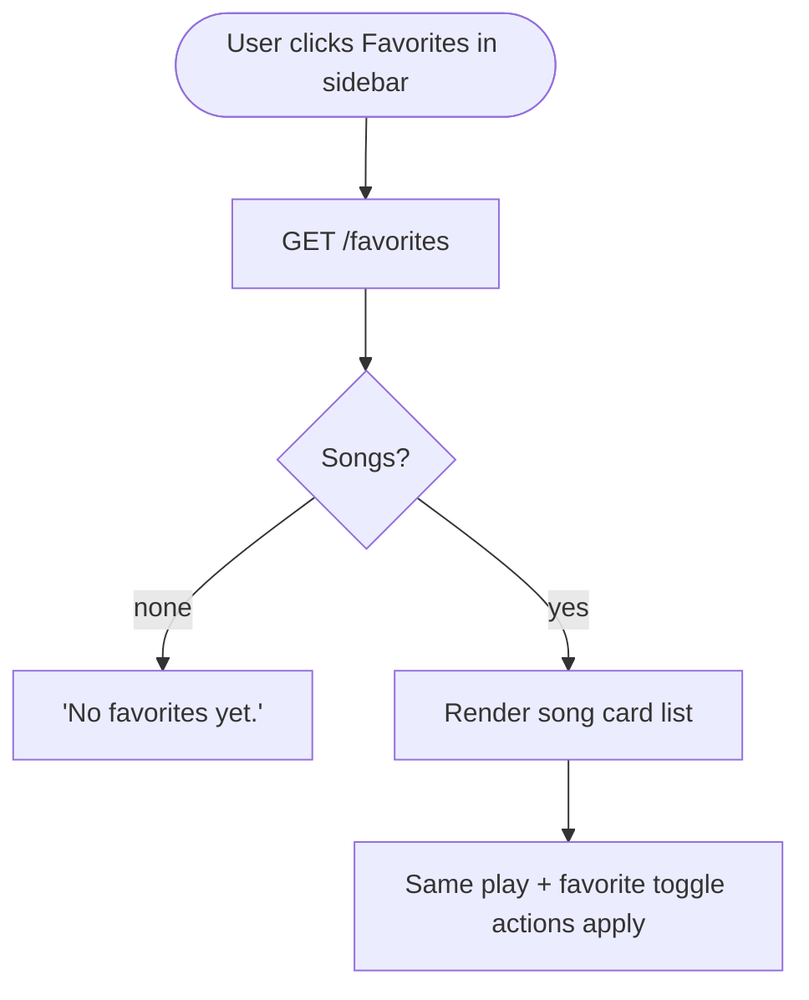
```mermaid
flowchart TD
    A([User clicks Favorites in sidebar]) --> B["GET /favorites"]
    B --> C{Songs?}
    C --none--> D["'No favorites yet.'"]
    C --yes--> E[Render song card list]
    E --> F[Same play + favorite toggle actions apply]
```

---

## 6. Playlists Page

```mermaid
flowchart TD
    A([User clicks Playlists in sidebar]) --> B["GET /playlists"]
    B --> C{Playlists?}
    C --none--> D["'No playlists yet.' + New Playlist button"]
    C --yes--> E[Render playlist card grid]
    E --> F{User action}
    F --clicks card--> G["Navigate to #/playlists/:id"]
    F --clicks + New Playlist--> H[Inline name input appears]
    H --> I[User types name + Enter]
    I --> J["POST /playlists { name }"]
    J --> K[Re-fetch full playlist grid\n— not just an append]
```

---

## 7. Playlist Detail Page

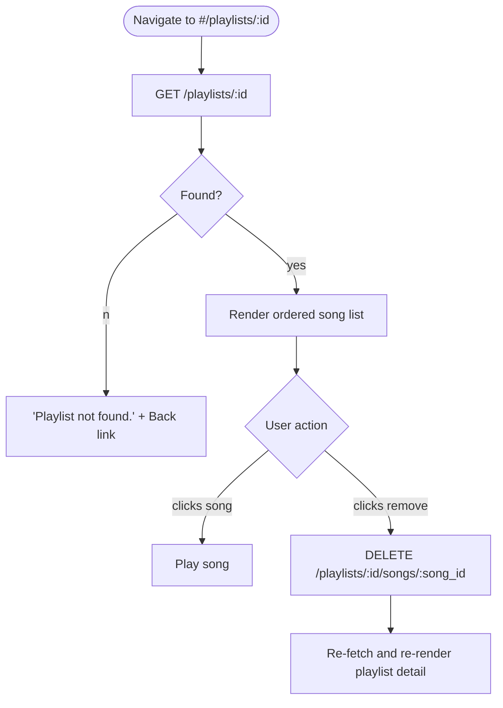
```mermaid
flowchart TD
    A(["Navigate to #/playlists/:id"]) --> B["GET /playlists/:id"]
    B --> C{Found?}
    C --no--> D["'Playlist not found.' + Back link"]
    C --yes--> E[Render ordered song list]
    E --> F{User action}
    F --clicks song--> G[Play song]
    F --clicks remove--> H["DELETE /playlists/:id/songs/:song_id"]
    H --> I[Re-fetch and re-render playlist detail]
```

### 7a. Drag Reorder (Sprint 6)

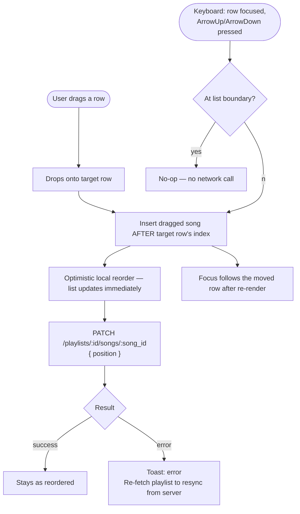
```mermaid
flowchart TD
    A([User drags a row]) --> B[Drops onto target row]
    B --> C["Insert dragged song AFTER target row's index"]
    C --> D["Optimistic local reorder — list updates immediately"]
    D --> E["PATCH /playlists/:id/songs/:song_id\n{ position }"]
    E --> F{Result}
    F --success--> G[Stays as reordered]
    F --error--> H["Toast: error\nRe-fetch playlist to resync from server"]

    I(["Keyboard: row focused,\nArrowUp/ArrowDown pressed"]) --> J{At list boundary?}
    J --yes--> K[No-op — no network call]
    J --no--> C
    C --> L[Focus follows the moved row after re-render]
```

> Drop-onto-row means "insert after", not "insert before" — dropping song A onto row 3 places A immediately after whatever is at position 3.

---

## 8. Add Song to Playlist

```mermaid
flowchart TD
    A([User clicks ⋮ on song card]) --> B[Dropdown opens]
    B --> C{User picks}

    C -- Existing playlist --> D["POST /playlists/:id/songs/:song_id"]
    D --> E["Toast: Added to playlist 'My Playlist'"]

    C -- New playlist --> F["window.prompt() for playlist name"]
    F -- Cancel --> G[No action]
    F -- Name entered --> H["POST /playlists { name }"]
    H --> I["POST /playlists/:new_id/songs/:song_id"]
    I --> J["Toast: Added to playlist 'Road Trip'"]
```

> "+ New playlist" does **not** open an inline text field inside the dropdown — it triggers a native `window.prompt()` dialog.

---

## 9. Delete a Song

```mermaid
flowchart TD
    A([User clicks ⋮ → Delete]) --> B["Confirm dialog:\n'Delete this song?\nThis cannot be undone.'"]
    B --> C{User choice}
    C --Cancel--> D[Close dialog]
    C --Delete--> E["DELETE /songs/:id"]
    E --> F[Modal closes, toast shown]
    F --> G{Was this song loaded\nin the player?}
    G --yes--> H["Player bar visually hidden\n(.player-bar--empty added)"]
    G --no--> I[Re-render current page via router]
    H --> I
```

> Deleting the currently-loaded song hides the player bar with CSS but does **not** stop playback or clear the `<audio>` element's source — if it was already playing, audio can keep playing in the background with the bar hidden.

---

## 10. Error States

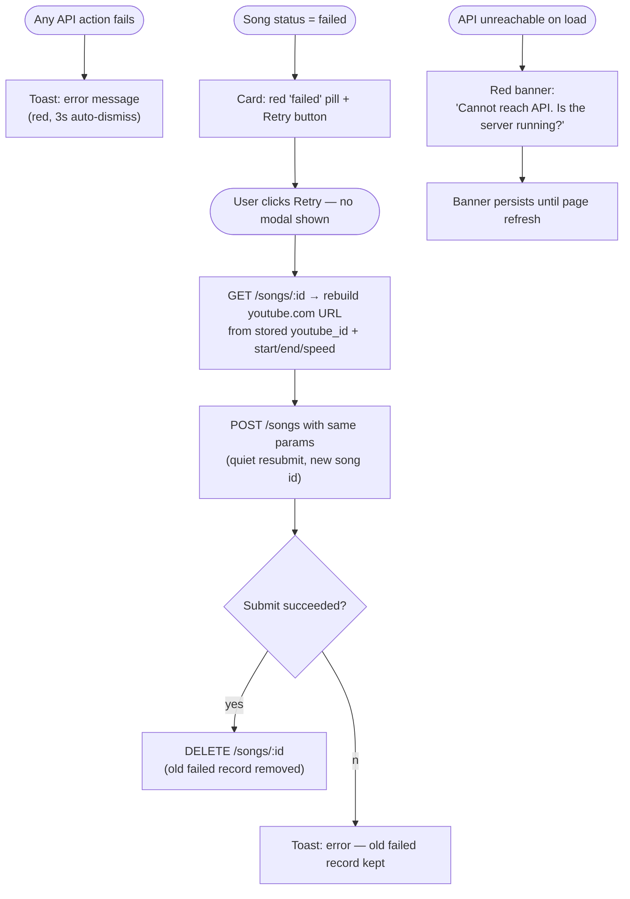
```mermaid
flowchart TD
    A([Any API action fails]) --> B["Toast: error message\n(red, 3s auto-dismiss)"]

    C([Song status = failed]) --> D["Card: red 'failed' pill + Retry button"]
    D --> E([User clicks Retry — no modal shown])
    E --> F["GET /songs/:id → rebuild youtube.com URL\nfrom stored youtube_id + start/end/speed"]
    F --> G["POST /songs with same params\n(quiet resubmit, new song id)"]
    G --> H{Submit succeeded?}
    H --yes--> I["DELETE /songs/:id\n(old failed record removed)"]
    H --no--> J[Toast: error — old failed record kept]

    K([API unreachable on load]) --> L["Red banner:\n'Cannot reach API. Is the server running?'"]
    L --> M[Banner persists until page refresh]
```

> Retry never reopens the Add Song modal. It silently re-submits the same URL/trim/speed as a brand-new song (new ID) and only deletes the old failed record **after** the resubmit succeeds, so a failed retry never loses the original record.

---

## Navigation Overview

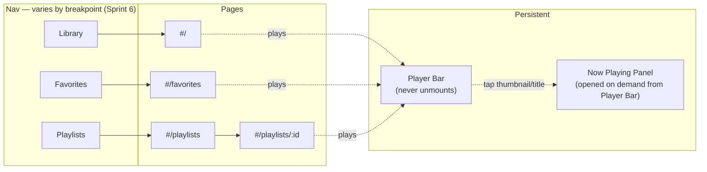
```mermaid
flowchart LR
    subgraph Nav ["Nav — varies by breakpoint (Sprint 6)"]
        L[Library]
        FAV[Favorites]
        PL[Playlists]
    end

    subgraph Pages
        LibPage["#/"]
        FavPage["#/favorites"]
        PlPage["#/playlists"]
        PlDetail["#/playlists/:id"]
    end

    subgraph Persistent
        Player["Player Bar\n(never unmounts)"]
        NP["Now Playing Panel\n(opened on demand from Player Bar)"]
    end

    L --> LibPage
    FAV --> FavPage
    PL --> PlPage
    PlPage --> PlDetail

    LibPage -.plays.-> Player
    FavPage -.plays.-> Player
    PlDetail -.plays.-> Player
    Player -.tap thumbnail/title.-> NP
```

> **(Sprint 6)** Nav rendering differs by breakpoint: full sidebar with labels at >=1280px, icon-only 56px rail at 768–1279px, bottom tab bar (same 3 routes) at <=767px — plus a floating Add Song button on phone since the sidebar's Add Song button isn't reachable there. The three routes and their behavior are identical across all three; only the nav chrome differs.

---

## Keyboard Shortcuts

| Key                     | Action                                                                                                         |
| ----------------------- | -------------------------------------------------------------------------------------------------------------- |
| `Space`                 | Play / pause current song (ignored while focus is in an `<input>`/`<select>`)                                  |
| `Esc`                   | Closes the topmost open surface only, in priority order: Now Playing panel → open dropdown menu → modal        |
| `Enter`                 | Submit inline input (playlist name field, Add Song URL step)                                                   |
| `Tab` / `Shift+Tab`     | Cycles focus; trapped within an open modal or the Now Playing panel while either is open                       |
| `ArrowUp` / `ArrowDown` | **(Sprint 6)** Reorders the focused playlist row up/down (Playlist Detail page only), no-op at list boundaries |
| `Enter` / `Space`       | **(Sprint 6)** Opens the Now Playing panel when the player bar's info area (`#player-info-trigger`) is focused |
