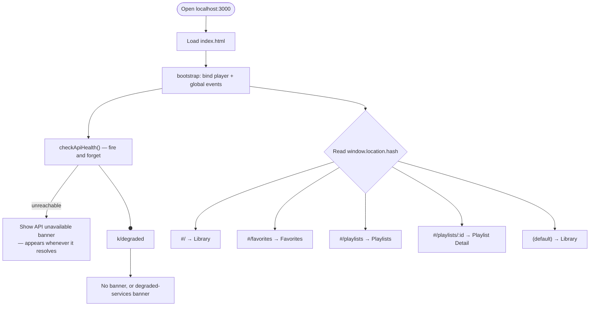
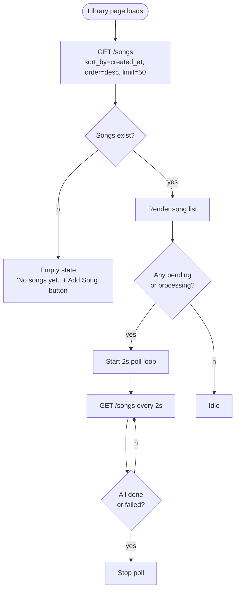
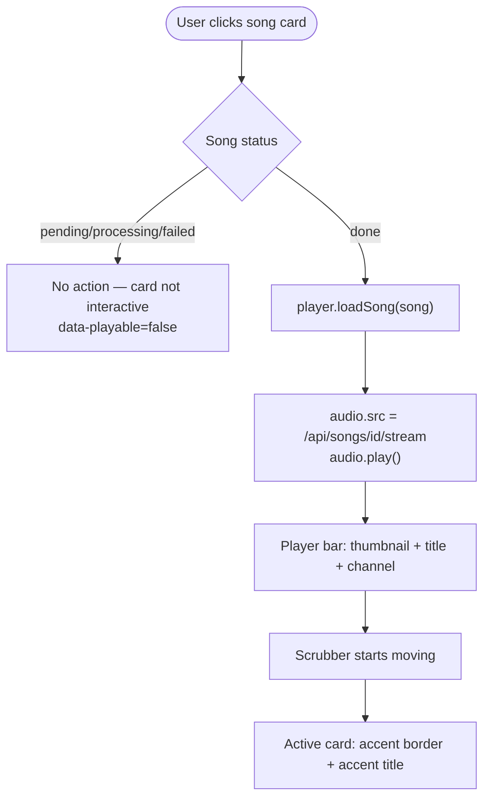
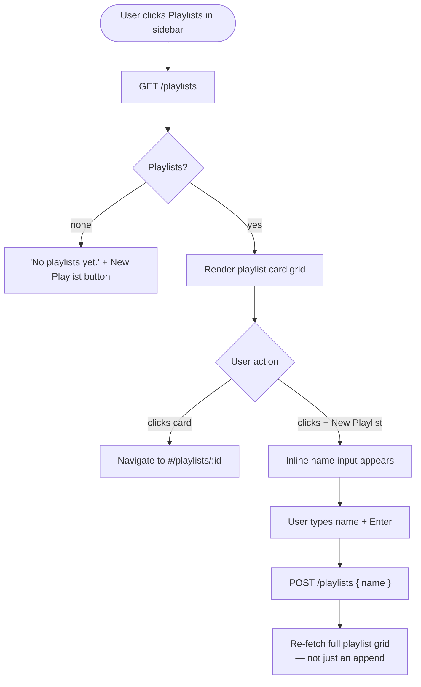
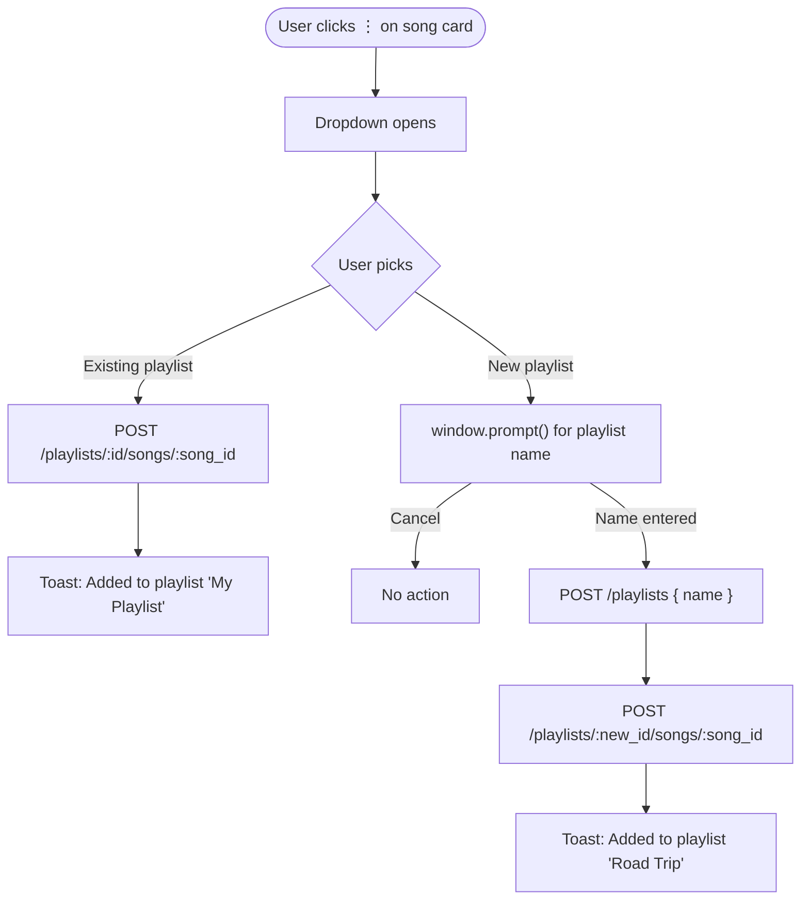
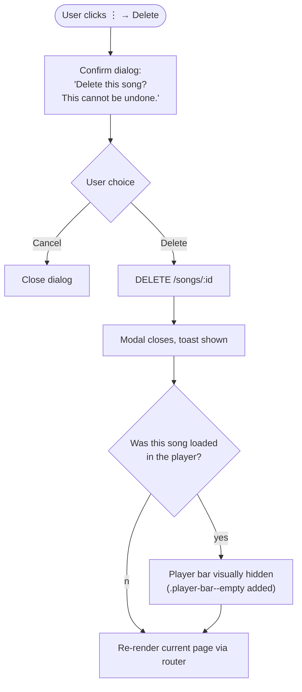
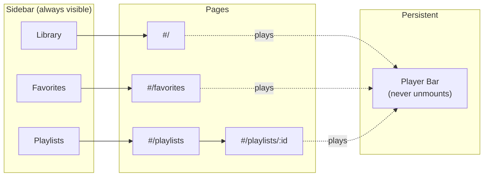

# Melo — User Flow

> How a user moves through the app from first open to organized library.

---

## App Entry

Health check and hash routing run **concurrently**, not sequentially — `checkApiHealth()` is fired without `await` in `bootstrap()`, so the app renders the current route immediately rather than waiting on `/health` first.

```mermaid
flowchart TD
    A([Open localhost:3000]) --> B[Load index.html]
    B --> C[bootstrap: bind player + global events]
    C --> D["checkApiHealth() — fire and forget"]
    C --> E{Read window.location.hash}
    D --unreachable--> F[Show API unavailable banner\n— appears whenever it resolves]
    D --ok/degraded--> G[No banner, or degraded-services banner]
    E --> H["#/ → Library"]
    E --> I["#/favorites → Favorites"]
    E --> J["#/playlists → Playlists"]
    E --> K["#/playlists/:id → Playlist Detail"]
    E --> L["(default) → Library"]
```

---

## 1. Library Page

```mermaid
flowchart TD
    A([Library page loads]) --> B["GET /songs\nsort_by=created_at, order=desc, limit=50"]
    B --> C{Songs exist?}
    C --no--> D["Empty state\n'No songs yet.' + Add Song button"]
    C --yes--> E[Render song list]
    E --> F{Any pending\nor processing?}
    F --yes--> G[Start 2s poll loop]
    G --> H["GET /songs every 2s"]
    H --> I{All done\nor failed?}
    I --no--> H
    I --yes--> J[Stop poll]
    F --no--> K[Idle]
```

### 1a. Filter / Search / Sort

```mermaid
flowchart LR
    A([User types search]) --> B[Debounce 300ms]
    B --> C["GET /songs?search=query"]
    C --> D[Re-render list]

    E([User picks status filter]) --> F["GET /songs?status=value"]
    F --> D

    G([User picks sort]) --> H["GET /songs?sort_by=field&order=asc|desc"]
    H --> D
```

### 1b. Pagination

```mermaid
flowchart TD
    A([User clicks Load more]) --> B["GET /songs?after=bookmark"]
    B --> C{"bookmark present AND\nfull page returned\n(records.length >= limit)?"}
    C --no--> D[Hide Load more button\n— treated as end of results]
    C --yes--> E[Append songs to list]
    E --> F[Update stored bookmark]
```

> A non-null `bookmark` alone isn't enough to keep paging — a short page (fewer records than `limit`) is also treated as the end, even if the API returned a bookmark.

---

## 2. Add Song Flow

```mermaid
flowchart TD
    A([User clicks + Add Song]) --> B[Modal opens — Step 1]
    B --> C[User pastes YouTube URL]
    C --> D{Input empty?}
    D --yes--> E[Preview button disabled]
    D --no--> F([User clicks Preview or presses Enter])
    F --> G[Step 1 shows spinner: field disabled, 'Fetching…']
    G --> H["POST /songs/preview"]
    H --> I{Result}
    I --422/502--> J[Re-show Step 1 with inline error\n+ URL preserved, field re-enabled]
    J --> C
    I --200--> K[Step 2: show thumbnail\ntitle · channel · duration]
    K --> L[User adjusts start / end / speed]
    L --> M{Action}
    M --Cancel--> N[Close modal]
    M --Add to Melo--> O["POST /songs\n{ url, start?, end?, speed? }"]
    O --> P[Modal closes]
    P --> Q[Song in library — status: pending]
    Q --> R[Poll: pending → processing → done]
    R --> S[Song card becomes playable]
```

---

## 3. Play a Song

```mermaid
flowchart TD
    A([User clicks song card]) --> B{Song status}
    B --pending/processing/failed--> C[No action — card not interactive\ndata-playable=false]
    B --done--> D["player.loadSong(song)"]
    D --> E["audio.src = /api/songs/id/stream\naudio.play()"]
    E --> F[Player bar: thumbnail + title + channel]
    F --> G[Scrubber starts moving]
    G --> H[Active card: accent border + accent title]
```

> The **Retry** button on failed songs is a separate always-visible control next to the status pill, not something surfaced by clicking the card.

### 3a. Player Controls

```mermaid
flowchart LR
    A([Play/Pause clicked\nor Space key]) --> B{audio.paused?}
    B --yes--> C[audio.play]
    B --no--> D[audio.pause]

    E([Scrubber dragged]) --> F[audio.currentTime = scrubber.value on release]
    G([audio.ontimeupdate]) --> H[scrubber.value = audio.currentTime]

    I([Song ends]) --> J[Reset play icon + scrubber to 0]
```

> Space only toggles play/pause when focus isn't on an `<input>` or `<select>`.

---

## 4. Favorite Toggle

```mermaid
flowchart TD
    A([User clicks heart icon]) --> B{is_favorite?}
    B --false--> C[Heart fills immediately]
    C --> D["POST /favorites/song_id"]
    D --> E{Result}
    E --success--> F[Stays filled]
    E --error--> G[Reverts to outline]

    B --true--> H[Heart empties immediately]
    H --> I["DELETE /favorites/song_id"]
    I --> J{Result}
    J --success--> K[Stays empty]
    J --error--> L[Reverts to filled]
```

---

## 5. Favorites Page

```mermaid
flowchart TD
    A([User clicks Favorites in sidebar]) --> B["GET /favorites"]
    B --> C{Songs?}
    C --none--> D["'No favorites yet.'"]
    C --yes--> E[Render song card list]
    E --> F[Same play + favorite toggle actions apply]
```

---

## 6. Playlists Page

```mermaid
flowchart TD
    A([User clicks Playlists in sidebar]) --> B["GET /playlists"]
    B --> C{Playlists?}
    C --none--> D["'No playlists yet.' + New Playlist button"]
    C --yes--> E[Render playlist card grid]
    E --> F{User action}
    F --clicks card--> G["Navigate to #/playlists/:id"]
    F --clicks + New Playlist--> H[Inline name input appears]
    H --> I[User types name + Enter]
    I --> J["POST /playlists { name }"]
    J --> K[Re-fetch full playlist grid\n— not just an append]
```

---

## 7. Playlist Detail Page

```mermaid
flowchart TD
    A(["Navigate to #/playlists/:id"]) --> B["GET /playlists/:id"]
    B --> C{Found?}
    C --no--> D["'Playlist not found.' + Back link"]
    C --yes--> E[Render ordered song list]
    E --> F{User action}
    F --clicks song--> G[Play song]
    F --clicks remove--> H["DELETE /playlists/:id/songs/:song_id"]
    H --> I[Re-fetch and re-render playlist detail]
```

---

## 8. Add Song to Playlist

```mermaid
flowchart TD
    A([User clicks ⋮ on song card]) --> B[Dropdown opens]
    B --> C{User picks}

    C -- Existing playlist --> D["POST /playlists/:id/songs/:song_id"]
    D --> E["Toast: Added to playlist 'My Playlist'"]

    C -- New playlist --> F["window.prompt() for playlist name"]
    F -- Cancel --> G[No action]
    F -- Name entered --> H["POST /playlists { name }"]
    H --> I["POST /playlists/:new_id/songs/:song_id"]
    I --> J["Toast: Added to playlist 'Road Trip'"]
```

> "+ New playlist" does **not** open an inline text field inside the dropdown — it triggers a native `window.prompt()` dialog.

---

## 9. Delete a Song

```mermaid
flowchart TD
    A([User clicks ⋮ → Delete]) --> B["Confirm dialog:\n'Delete this song?\nThis cannot be undone.'"]
    B --> C{User choice}
    C --Cancel--> D[Close dialog]
    C --Delete--> E["DELETE /songs/:id"]
    E --> F[Modal closes, toast shown]
    F --> G{Was this song loaded\nin the player?}
    G --yes--> H["Player bar visually hidden\n(.player-bar--empty added)"]
    G --no--> I[Re-render current page via router]
    H --> I
```

> Deleting the currently-loaded song hides the player bar with CSS but does **not** stop playback or clear the `<audio>` element's source — if it was already playing, audio can keep playing in the background with the bar hidden.

---

## 10. Error States

```mermaid
flowchart TD
    A([Any API action fails]) --> B["Toast: error message\n(red, 3s auto-dismiss)"]

    C([Song status = failed]) --> D["Card: red 'failed' pill + Retry button"]
    D --> E([User clicks Retry — no modal shown])
    E --> F["GET /songs/:id → rebuild youtube.com URL\nfrom stored youtube_id + start/end/speed"]
    F --> G["POST /songs with same params\n(quiet resubmit, new song id)"]
    G --> H{Submit succeeded?}
    H --yes--> I["DELETE /songs/:id\n(old failed record removed)"]
    H --no--> J[Toast: error — old failed record kept]

    K([API unreachable on load]) --> L["Red banner:\n'Cannot reach API. Is the server running?'"]
    L --> M[Banner persists until page refresh]
```

> Retry never reopens the Add Song modal. It silently re-submits the same URL/trim/speed as a brand-new song (new ID) and only deletes the old failed record **after** the resubmit succeeds, so a failed retry never loses the original record.

---

## Navigation Overview

```mermaid
flowchart LR
    subgraph Sidebar ["Sidebar (always visible)"]
        L[Library]
        FAV[Favorites]
        PL[Playlists]
    end

    subgraph Pages
        LibPage["#/"]
        FavPage["#/favorites"]
        PlPage["#/playlists"]
        PlDetail["#/playlists/:id"]
    end

    subgraph Persistent
        Player["Player Bar\n(never unmounts)"]
    end

    L --> LibPage
    FAV --> FavPage
    PL --> PlPage
    PlPage --> PlDetail

    LibPage -.plays.-> Player
    FavPage -.plays.-> Player
    PlDetail -.plays.-> Player
```

---

## Keyboard Shortcuts

| Key     | Action                                                                                              |
| ------- | --------------------------------------------------------------------------------------------------- |
| `Space` | Play / pause current song (ignored while focus is in an `<input>`/`<select>`)                       |
| `Esc`   | Close modal. **Does not** close the song-card dropdown menu — that only closes on an outside click. |
| `Enter` | Submit inline input (playlist name field, Add Song URL step)                                        |
